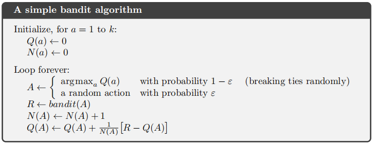

# 第2章 多臂赌博机

## 一个k臂赌博机问题

在多臂赌博机问题中，任意动作$$a$$对应的价值记为$$q_*(a)$$ ，在$$t$$时刻选择的动作记为$$A_t$$，对应的收益记为$$R_t$$，$$q_*(a)$$ 定义为
$$
q_{*}(a) \doteq \mathbb{E}\left[R_{t} | A_{t}=a\right]
$$
如果知道了每个动作的价值，那么该问题就很简单，但我们不能得到确切的值，我们可以利用$$Q_t(a)$$来估值，$$Q_t(a)$$的计算方法就是，在过去所有时间中，通采取动作$$a$$得到的全部收益，除以采取动作$$a$$的次数
$$
Q_{t}(a) \doteq \frac{\text { sum of rewards when } a \text { taken prior to } t}{\text { number of times } a \text { taken prior to } t}=\frac{\sum_{i=1}^{t-1} R_{i} \cdot \mathbb{1}_{A_{i}=a}}{\sum_{i=1}^{t-1} \mathbb{1}_{A_{i}=a}}
$$
当我们在估值的过程中，当采取的动作为最高收益的动作时，称为“利用”或“贪心”，当采取其他动作时，称为“探索”或“试探”，“贪心”的动作记作
$$
A_{t} {\doteq {\underset{a}{\arg \max } Q_{t}(a)}}
$$
一个贪心策略是，大部分时间表现为利用，而偶尔表现为探索。（$$\varepsilon$$-贪心）

## 10臂测试平台

下图表示一个10臂赌博机测试平台的收益分布-动作关系图，共有10个动作，动作的真实价值$$q_*(a)$$，从一个均值为0，方差为1的高斯分布中选取，当采取动作$$A_{t}$$时，得到的收益$$R_t$$服从均值为$$q_{*}(A_{t})$$的高斯分布。

实验结果如下图所示，这些数据是2000次不同的多臂赌博机实验的平均，$$\varepsilon=0.1$$的方法试探更多，通常可以更快得选择到最优的动作，但选取最优动作的概率永远不会超过90%，因为还要有10%的概率探索，$$\varepsilon=0.01$$的方法改善很慢，在图中两种测度下$$\varepsilon=0.1$$的方法的方法更好。随着时间推移，逐渐减小$$\varepsilon$$也是可以的。

如果收益的方差不是1而是10，那么$$\varepsilon$$-贪心方法会比贪心方法好很多。

## 增量式实现

探讨一种保持常数级内存需求以及常数级单时刻计算量的计算平均值估计收益的方式，令$$R_i$$表示这一动作被选择第$i$次后获得的收益，$$Q_n$$表示选择$$n-1$$次后的**估计的动作价值**
$$
Q_{n} \doteq \frac{R_{1}+R_{2}+\cdots+R_{n-1}}{n-1}
$$
这样每次计算都要对全部分子进行求和，我们不必这样做，可以这样计算
$$
\begin{aligned}
Q_{n+1} &=\frac{1}{n} \sum_{i=1}^{n} R_{i} \\
&=\frac{1}{n}\left(R_{n}+\sum_{i=1}^{n-1} R_{i}\right) \\
&=\frac{1}{n}\left(R_{n}+(n-1) \frac{1}{n-1} \sum_{i=1}^{n-1} R_{i}\right) \\
&=\frac{1}{n}\left(R_{n}+(n-1) Q_{n}\right) \\
&=\frac{1}{n}\left(R_{n}+n Q_{n}-Q_{n}\right) \\
&=Q_{n}+\frac{1}{n}\left[R_{n}-Q_{n}\right]
\end{aligned}
$$
这个式子对$$n=1$$也有效，对任意$$Q_1$$，都有$$Q_{2}=R_{1}$$。对于每一个新的收益，只需存储$$Q_n$$和$$n$$。这里$$Q_1$$的值后面会作讨论。

更新公式的形式将会贯穿始终，一般形式为
$$
NewEstimate \leftarrow OldEstimate + StepSize [ Target - OldEstimate ]
$$
$$[ Target - OldEstimate ]$$是估计值的误差，上述$$Q_n$$增量方式中补偿会随时间变化，步长为$$\frac{1}{n}$$，后面也可记作$$\alpha$$或更普适地记作$$\alpha_t(a)$$

一个完整的使用增量式计算估值的$$\varepsilon$$-贪心的赌博机问题算法如下，`bandit(a)`函数接收一个动作，返回一个对应的收益。

## 非平稳问题

刚刚所讨论的情况中收益的概率分布不随时间变化，但如果收益的概率分布随时间变化，那么这是一个非平稳问题，这样，近期收益要比过去更久远的收益有更高的权值是合理的处理方式。我们可以使用固定步长，用来更新$$Q_n$$
$$
Q_{n+1} \doteq Q_{n}+\alpha\left[R_{n}-Q_{n}\right]
$$

步长参数$$\alpha \in(0,1]$$

$$
\begin{aligned}
Q_{n+1} &=Q_{n}+\alpha\left[R_{n}-Q_{n}\right] \\
&=\alpha R_{n}+(1-\alpha) Q_{n} \\
&=\alpha R_{n}+(1-\alpha)\left[\alpha R_{n-1}+(1-\alpha) Q_{n-1}\right] \\
&=\alpha R_{n}+(1-\alpha) \alpha R_{n-1}+(1-\alpha)^{2} Q_{n-1} \\
&=\alpha R_{n}+(1-\alpha) \alpha R_{n-1}+(1-\alpha)^{2} \alpha R_{n-2}+\\
& \quad=(1-\alpha)^{n} Q_{1}+\sum_{i=1}^{n} \alpha(1-\alpha)^{n-i} R_{i}
\end{aligned}
$$

我们将此称为加权平均，可以验证$$(1-\alpha)^{n}+\sum_{i=1}^{n} \alpha(1-\alpha)^{n-i}=1$$

权值$$\alpha(1-\alpha)^{n-i}$$取决与被观测到的时刻与现在时刻的差，权值随时间的差距以指数形式递减

当步长选为$$\alpha_{n}(a)=\frac{1}{n}$$时，大数定律将保证结果收敛到真实值，随机逼近理论中的一个结果给出了保证收敛的条件：
$$
\sum_{n=1}^{\infty} \alpha_{n}(a)=\infty \quad \text { and } \quad \sum_{n=1}^{\infty} \alpha_{n}^{2}(a)<\infty
$$
$$\alpha_{n}(a)=\frac{1}{n}$$恰好可以满足上面两个式子，而$$\alpha_{n}(a)=\alpha$$则不能满足第二个式子，所以最总无法完全收敛，而会随着最近得到的收益而变化，这在非平稳环境中正是我们想要的。

问题2.4指出，如果步长$$\alpha_n$$不是常数，那么

令$$\alpha_0=1$$，有
$$
Q_{n+1}=\left(\prod_{i=1}^{n}\left(1-\alpha_{i}\right)\right) Q_{1}+\sum_{i=1}^{n} \alpha_{i} R_{i} \prod_{k=i+1}^{n}\left(1-\alpha_{k}\right)
$$
权重为$$\prod_{k=i+1}^{n}\left(1-\alpha_{k}\right)$$

## 乐观的初始值

我们目前讨论的方法都一定程度上依赖初始值$$Q_{1}(a)$$，从统计学角度，这些方法是**有偏**的。设定一个初始值可以视作一种鼓励探索的方法，比方说全部设为$$+5$$而不是$$0$$，直观地解释是因为无论选哪种动作，得到的收益都比开始的值要小，因此算法会对收益感到“失望”（增量公式中的误差$$R_{n}-Q_{n}$$为负值），从而转向探索其他动作。乐观初始值在稳定问题中非常有效，但是在非稳定的问题中并不有效，因为它的探索驱动力是暂时的。图中曲线为使用两种初始值得到的结果。

值得注意的是在乐观初始值方法中，早期会出现震荡和峰值，这是因为在探索完全部动作之后，agent才会倾向于选择“贪心”

问题2.7给出了一个无偏恒定步长的trick：

将步长设为
$$
\beta_{n} \doteq \alpha / \bar{o}_{n}
$$
$\bar{o}_{t}$是一个从0时刻开始计算的修正系数
$$
\bar{o}_{n} \doteq \bar{o}_{n-1}+\alpha\left(1-\bar{o}_{n-1}\right),\quad \text { for } n \geq 0, \quad \text { with } \bar{\sigma}_{0} \doteq 0
$$
证明

可知$$$\beta_{1}=1$$

由问题2.4可知，当步长变化时，权重可表示为
$$
w_{i}=\beta_{i} \prod_{k=i+1}^{n}\left(1-\beta_{k}\right)
$$

对于固定的$$n$$，进而有
$$
\frac{w_{i+1}}{w_{i}}=\frac{\beta_{i+1}}{\beta_{i}\left(1-\beta_{i+1}\right)}=\frac{1}{1-\alpha}>1
$$
其中$\alpha<1 . \text { If } \alpha=1 \text { then } \beta_{t}=1 \forall t$

## 基于置信度上界的动作选择

尽管我们使用$$\varepsilon$$-贪心算法能够尝试选择非贪心的动作，但这是一种盲目的选择，而要根据其他的动作的潜力选择可能是最优的动作，一个可行的方法
$$
A_{t} \doteq \underset{a}{\arg \max }\left[Q_{t}(a)+c \sqrt{\frac{\ln t}{N_{t}(a)}}\right]
$$
其中$$N_{t}(a)$$表示动作$$a$$被选择过的次数，若$$N_{t}(a)=0$$，则动作$$a$$被认为是满足最大化条件的动作

这种基于**置信度上界**（UCB）的动作选择策略的思想是，平方根项是对动作$$a$$价值估计的不确定性（方差）的度量。因此，最大值的大小是动作$a$的可能真实值的上限，参数$$c$$决定了置信水平。每选择一次动作$$a$$，$$N_{t}(a)$$就会增大，不确定性就会减小；而对于其他动作，分母$$\ln t$$在增大，而分母不变，不确定性就会增大。随着时间流逝，那些较低估计价值的或多次被选择的动作被选择的可能性较低。

使用UCB会在第11次出现一个尖峰，因为前10次将所有动作探索一遍，11次选择了一个最优的动作。后续的过程将不再出现尖峰，是因为$$N_{t}=O(t) \text { and } \ln (t) / t \rightarrow 0$$，所以策略近似于贪心。

## 梯度赌博机算法

我们考虑学习一个数值化的偏好函数$$H_{t}(a)$$，则可按照softmax分布确定动作概率
$$
\operatorname{Pr}\left\{A_{t}=a\right\} \doteq \frac{e^{H_{t}(a)}}{\sum_{b=1}^{k} e^{H_{t}(b)}} \doteq \pi_{t}(a)
$$
$$\pi_{t}(a)$$表示在$$t$$时刻选择动作$$a$$的概率，所有动作的偏好函数的初始值都是一样的，所以每个动作被选择的

概率是一样的。

可以将梯度赌博机算法理解为梯度上升的随机近似，与梯度上升类似，$$\mathbb{E}\left[R_{t}\right]$$相当于目标函数（性能衡量指标），$$H(a)$$相当于待优化的参数，$$H_t(a)$$的更新方式如下
$$
H_{t+1}(a) \doteq H_{t}(a)+\alpha \frac{\partial \mathbb{E}\left[R_{t}\right]}{\partial H_{t}(a)}
$$
$$\mathbb{E}\left[R_{t}\right]$$表示总体的期望收益（从初始到$$t$$时刻）
$$
\mathbb{E}\left[R_{t}\right]=\sum_{x} \pi_{t}(x) q_{*}(x)
$$
将偏导数这一项展开
$$
\begin{aligned}
\frac{\partial \mathbb{E}\left[R_{t}\right]}{\partial H_{t}(a)} &=\frac{\partial}{\partial H_{t}(a)}\left[\sum_{x} \pi_{t}(x) q_{*}(x)\right] \\
&=\sum_{x} q_{*}(x) \frac{\partial \pi_{t}(x)}{\partial H_{t}(a)} \\
&=\sum_{x}\left(q_{*}(x)-B_{t}\right) \frac{\partial \pi_{t}(x)}{\partial H_{t}(a)}
\end{aligned}
$$
这里的$$B_t$$是与$$x$$无关的*baseline*（基准项），加入这一项对结果没有任何影响，因为由于概率之和恒为1，所以概率的变化的和恒为0，就是说$$\sum_{x} \frac{\partial \pi_{t}(x)}{\partial H_{t}(a)}=0$$，进而$$-B_t\sum_{x} \frac{\partial \pi_{t}(x)}{\partial H_{t}(a)}=0$$

接下来将求和式中的每项都乘以$$\pi_{t}(x) / \pi_{t}(x)$$
$$
\frac{\partial \mathbb{E}\left[R_{t}\right]}{\partial H_{t}(a)}=\sum_{x} \pi_{t}(x)\left(q_{*}(x)-B_{t}\right) \frac{\partial \pi_{t}(x)}{\partial H_{t}(a)} / \pi_{t}(x)
$$
上式可以看作一个“求期望”的式子，并用$$\bar{R}_{t}$$表示*baseline*，$$R_t$$替换$$q_{*}(A_t)$$，这样做是合理的，因为$$\mathbb{E}\left[R_{t} | A_{t}\right]=q_{*}\left(A_{t}\right)$$，所以可以化简为
$$
\begin{aligned}
&=\mathbb{E}\left[\left(q_{*}\left(A_{t}\right)-B_{t}\right) \frac{\partial \pi_{t}\left(A_{t}\right)}{\partial H_{t}(a)} / \pi_{t}\left(A_{t}\right)\right]\\
&=\mathbb{E}\left[\left(R_{t}-\bar{R}_{t}\right) \frac{\partial \pi_{t}\left(A_{t}\right)}{\partial H_{t}(a)} / \pi_{t}\left(A_{t}\right)\right]
\end{aligned}
$$
为求得其中的$$\frac{\partial \pi_{t}\left(A_{t}\right)}{\partial H_{t}(a)}$$，我们考虑两个函数的商的导数
$$
\frac{\partial}{\partial x}\left[\frac{f(x)}{g(x)}\right]=\frac{\frac{\partial f(x)}{\partial x} g(x)-f(x) \frac{\partial g(x)}{\partial x}}{g(x)^{2}}
$$
因此，我们可以得到
$$
\begin{aligned}
\frac{\partial \pi_{t}(x)}{\partial H_{t}(a)} &=\frac{\partial}{\partial H_{t}(a)} \pi_{t}(x) \\
&=\frac{\partial}{\partial H_{t}(a)}\left[\frac{e^{H_{t}(x)}}{\sum_{y=1}^{k} e^{H_{t}(y)}}\right] \\
&=\frac{\frac{\partial e^{H_{t}(x)}}{\partial H_{t}(a)} \sum_{y=1}^{k} e^{H_{t}(y)}-e^{H_{t}(x)} \frac{\partial \sum_{y=1}^{k} e^{H_{t}(y)}}{\partial H_{t}(a)}}{\left(\sum_{y=1}^{k} e^{H_{t}(y)}\right)^{2}} \\
&=\frac{\mathbb{1}_{a=x} e^{H_{t}(x)} \sum_{y=1}^{k} e^{H_{t}(y)}-e^{H_{t}(x)} e^{H_{t}(a)}}{\left(\sum_{y=1}^{k} e^{H_{t}(y)}\right)^{2}} \\
&=\frac{\mathbb{1}_{a=x} e^{H_{t}(x)}}{\sum_{y=1}^{k} e^{H_{t}(y)}}-\frac{e^{H_{t}(x)} e^{H_{t}(a)}}{\left(\sum_{y=1}^{k} e^{H_{t}(y)}\right)^{2}} \\
&=\mathbb{1}_{a=x} \pi_{t}(x)-\pi_{t}(x) \pi_{t}(a) \\
&=\pi_{t}(x)\left(\mathbb{1}_{a=x}-\pi_{t}(a)\right)
\end{aligned}
$$
代入上式，可以得到
$$
H_{t+1}(a)=H_{t}(a)+\alpha\left(R_{t}-\bar{R}_{t}\right)\left(\mathbb{1}_{a=A_{t}}-\pi_{t}(a)\right)
$$
或记为
$$
\begin{aligned}
H_{t+1}\left(A_{t}\right) & \doteq H_{t}\left(A_{t}\right)+\alpha\left(R_{t}-\bar{R}_{t}\right)\left(1-\pi_{t}\left(A_{t}\right)\right), & & \text { and } \\
H_{t+1}(a) & \doteq H_{t}(a)-\alpha\left(R_{t}-\bar{R}_{t}\right) \pi_{t}(a), & & \text { for all } a \neq A_{t}
\end{aligned}
$$
从实验结果可以看出具有*baseline*效果明显变好，这里$$q_{*}(a)$$设为$$+4$$而不是$$0$$

## 关联搜索（上下文相关的赌博机）

在一般的强化学习问题中，往往不止有一种情景，它们的目标是学习一个策略：从特定情境到最优动作的映射。关联搜索的解释引用一段原文

Associative search tasks are often now called *contextual bandits* in the literature.

Associative search tasks are intermediate between the *k*-armed bandit problem and the full reinforcement learning problem.

They are like the full reinforcement learning problem in that they **involve learning a policy**, but like our version of the *k*-armed bandit problem in that **each action affects only the immediate reward**.

If actions are allowed to affect the *next situation* as well as the reward, then we have the full reinforcement learning problem. 

问题2.10是一个很好的例子，详见原文

## 本章小结

参数研究图表明

- 每个算法曲线呈倒U形

- 所有算法在其参数的中间值处表现最好，即不太大也不太小

- 这些算法都是不敏感的，总的来说UCB表现最好

  

后面提到了解决k臂赌博机中开发和利用的tradeoff的方案，但没有详细展开，包括*Gittins*指数和贝叶斯方法