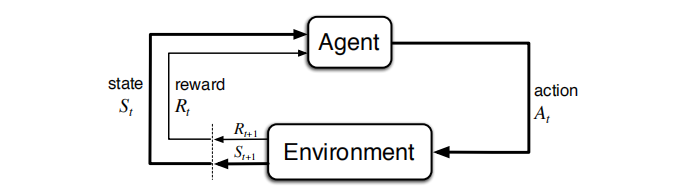
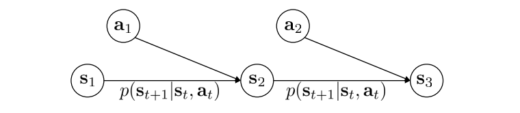
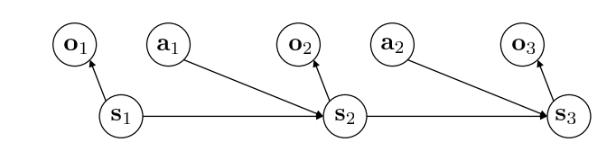
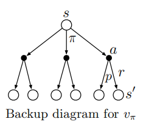
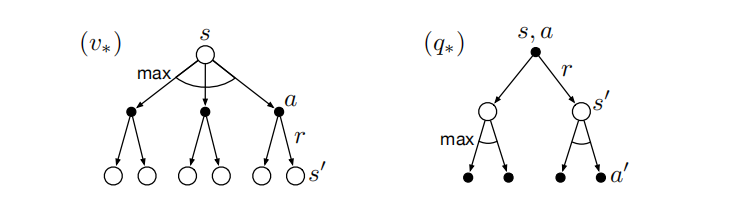
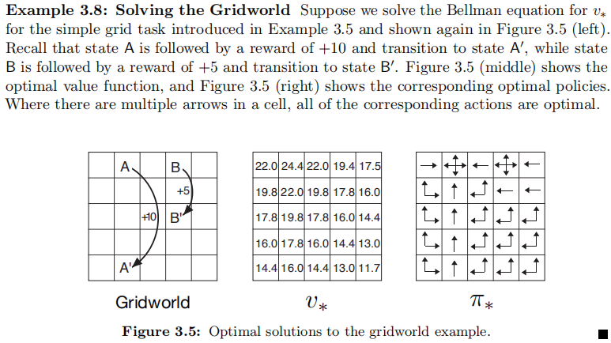

# 第3章 有限马尔可夫决策过程

该章节笔记部分参考了[Berkeley CS285 lec-4](http://rail.eecs.berkeley.edu/deeprlcourse/static/slides/lec-4.pdf)

## 定义和概念

马尔可夫决策过程（MDF）是一种通过交互式学习来实现目标的理论框架，是强化学习问题在数学上的理想化形式。

马尔可夫决策过程描述的智能体与环境的交互描述为如下图所示

当智能体处于状态$$S_t$$（这里假设智能体是*fully observation*的，*partial observation*的情况用$$O_t$$表示），采取动作$$A_t$$，进入状态$$S_{t+1}$$，得到收益$$R_{t+1}$$。

- *fully observation*

- *partial observation*

有了这样一个决策过程，我们就可以得到一个轨迹（*trajectory*）
$$
S_{0}, A_{0}, R_{1}, S_{1}, A_{1}, R_{2}, S_{2}, A_{2}, R_{3}, \dots
$$
需要注意的是，这里定义的状态和动作的下标是从0开始的，而收益的下标则是从1开始的

进而，我们可以得到一个四参数函21数，它定义了MDP的**动态特性**
$$
p\left(s^{\prime}, r | s, a\right) \doteq \operatorname{Pr}\left\{S_{t}=s^{\prime}, R_{t}=r | S_{t-1}=s, A_{t-1}=a\right\} \\
\text { for all } s^{\prime}, s \in \mathcal{S}, r \in \mathcal{R}, \text { and } a \in \mathcal{A}(s)
$$
MDP中$$p$$完全刻画了环境的动态特性，$$S_t$$和$$R_t$$取值的概率，只取决于$$S_{t-1}$$和$$A_{t-1}$$，并且和更早之前的状态和动作完全无关，这样我们认为状态具有**马尔可夫特性**，注意，这个特性是针对状态的，而不是决策过程。

由这个四参数函数，可以得到三个非常有用的函数

- 状态转移概率
  $$
  p\left(s^{\prime} | s, a\right) \doteq \operatorname{Pr}\left\{S_{t}=s^{\prime} | S_{t-1}=s, A_{t-1}=a\right\}=\sum_{r \in \mathcal{R}} p\left(s^{\prime}, r | s, a\right)
  $$

- “状态-动作”的期望收益
  $$
  r(s, a) \doteq \mathbb{E}\left[R_{t} | S_{t-1}=s, A_{t-1}=a\right]=\sum_{r \in \mathcal{R}} r \sum_{s^{\prime} \in \mathcal{S}} p\left(s^{\prime}, r | s, a\right)
  $$

- “状态-动作-后继动作”的期望收益

$$
r\left(s, a, s^{\prime}\right) \doteq \mathbb{E}\left[R_{t} | S_{t-1}=s, A_{t-1}=a, S_{t}=s^{\prime}\right]=\sum_{r \in \mathcal{R}} r \frac{p\left(s^{\prime}, r | s, a\right)}{p\left(s^{\prime} | s, a\right)}
$$

## 目标和收益

我们的目标是使得智能体能够最大化回报

一般来说，我们希望最大化期望回报
$$
G_{t} \doteq R_{t+1}+R_{t+2}+R_{t+3}+\cdots+R_{T}
$$
其中$$T$$为最终时刻，这种有限有时常的任务，我们成为**分幕式任务**（*episodic tasks*），交互冠城中的子序列成为**幕**（*episodes*），如一盘游戏或者一次走迷宫的旅程，需要注意，下一幕的开始与上一幕的结束完全无关。上面的写法表明$$T$$步中可能包含多个幕，事实证明，我们在讨论分幕式任务时，不必区分不同的幕，也就只有一个下标。

有时，我们需要区分非终结状态集$$\mathcal{S}$$和终结状态集$$\mathcal{S^+}$$，另外，终结时间$$T$$一般是一个随机变量。

另一方面，若$$T=\infin$$，我们称为**持续性任务**，我们试图最大化的回报有可能会趋于正无穷，所以，我需要引入**折扣**的概念，使得未来的回报是经过折扣加权后的（折后），折后回报定义为
$$
G_{t} \doteq R_{t+1}+\gamma R_{t+2}+\gamma^{2} R_{t+3}+\cdots=\sum_{k=0}^{\infty} \gamma^{k} R_{t+k+1}
$$
$$\gamma$$是一个参数，$$0 \leq \gamma \leq 1$$，称为**折扣率**

可以这样理解折扣率，$$\gamma$$越接近1，折后回报会更多地考虑未来收益，也就是说智能体是”有远见的“，若$$\gamma=0$$，智能体是”目光短浅的“，未来收益仅考虑了下一个动作执行后的收益。

我们也可用递归的方式描述
$$
\begin{aligned}
G_{t} & \doteq R_{t+1}+\gamma R_{t+2}+\gamma^{2} R_{t+3}+\gamma^{3} R_{t+4}+\cdots \\
&=R_{t+1}+\gamma\left(R_{t+2}+\gamma R_{t+3}+\gamma^{2} R_{t+4}+\cdots\right) \\
&=R_{t+1}+\gamma G_{t+1}
\end{aligned}
$$
现在我们考虑状态转移图

最后一个正方形表示**吸收状态**，从吸收状态不会转移到其他的状态，并且收益保持为0，这样与幕的结束相对应，因此，我们可以把分幕式和持续性任务统一表示为
$$
G_{t} \doteq \sum_{k=t+1}^{T} \gamma^{k-t-1} R_{k}
$$
上式允许$$T=\infin$$的可能性。

## 策略和价值函数

策略是从状态到每个动作的选择概率之间的映射，记作$$\pi(a|s)$$，对于每一个状态$$s$$，策略$$\pi(a|s)$$表示给出的在整个动作空间$$\mathcal{A}(s)$$上动作的概率分布。如果动作空间$$\mathcal{A}(s)$$是离散的则容易表示，如果动作空间$$\mathcal{A}(s)$$是连续的则实际中可以用一个高斯分布表示。

对于MDP，我们定义价值函数用来评估给定状态有多好
$$
v_{\pi}(s) \doteq \mathbb{E}_{\pi}\left[G_{t} | S_{t}=s\right]=\mathbb{E}_{\pi}\left[\sum_{k=0}^{\infty} \gamma^{k} R_{t+k+1} | S_{t}=s\right], \text { for all } s \in \mathcal{S}
$$
$$\mathbb{E}_{\pi}$$表示在给定策略$$\pi$$是一个随机变量的期望值，在CS285课程中，$$\sum_{k=0}^{\infty} \gamma^{k} R_{t+k+1}$$这一项习惯叫做*reward-to-go*（十分便于理解）。我们把$$v_{\pi}$$称为策略$$\pi$$的状态价值函数。Alpha Go中就有这样一个函数用来评价当前的棋局有多好。

类似地，我们把策略$$\pi$$下在状态$$s$$时采取动作$$a$$的价值记为$$q_{\pi}(s, a)$$，这个值用来评估在特定状态下采取摸个动作有多好。
$$
q_{\pi}(s, a) \doteq \mathbb{E}_{\pi}\left[G_{t} | S_{t}=s, A_{t}=a\right]=\mathbb{E}_{\pi}\left[\sum_{k=0}^{\infty} \gamma^{k} R_{t+k+1} | S_{t}=s, A_{t}=a\right]
$$
我们把$$q_{\pi}$$称为策略$$\pi$$的动作价值函数。

CS285课程中指出，价值函数和$$q$$函数之间有这样的关系
$$
v_{\pi}(s) \doteq \mathbb{E}_{a \sim \pi(a|s)}\left[q_{\pi}(s, a)\right]=\sum_{a} \pi(a | s) q(s, a)
$$
可以很直观地理解这个关系，$$q$$函数评估一个状态下采取特定动作有多好，价值函数评估一个状态有多好（不考虑采取动作），可以理解为一个”平均水平“，$$q_{\pi}(s, a)-v_{\pi}(s)$$也常用来表示一个动作的"优势"，也就是说这个动作相较于”平均水平有多好“。

我们还可以得到价值函数与其可能的后继状态的价值函数的关系
$$
\begin{aligned}
v_{\pi}(s) & \doteq \mathbb{E}_{\pi}\left[G_{t} | S_{t}=s\right] \\
&=\mathbb{E}_{\pi}\left[R_{t+1}+\gamma G_{t+1} | S_{t}=s\right] \\
&=\sum_{a} \pi(a | s) \sum_{s^{\prime}} \sum_{r} p\left(s^{\prime}, r | s, a\right)\left[r+\gamma \mathbb{E}_{\pi}\left[G_{t+1} | S_{t+1}=s^{\prime}\right]\right] \\
&=\sum_{a} \pi(a | s) \sum_{s^{\prime}, r} p\left(s^{\prime}, r | s, a\right)\left[r+\gamma v_{\pi}\left(s^{\prime}\right)\right], \quad \text { for all } s \in \mathcal{S}
\end{aligned}
$$
该式也被称为**贝尔曼方程**，为了便于理解，考察$$v_{\pi}(s)$$的回溯图

图中白色节点表示状态，黑色的节点表示动作

先注意到式子的第2个求和符号，这一步对应了树的第二层，把$$r+\gamma v_{\pi}\left(s^{\prime}\right)$$ 做加权求和，权重为 $$p\left(s^{\prime}, r | s, a\right)$$，也就是从黑色的动作节点分叉到某一状态的概率；第1个求和符号又是一步加权求和，权重为$$p\left(s^{\prime}, r | s, a\right)$$。这也说明了状态的价值一定等于后继状态的折扣期望加上对应收益的期望。

## 最优策略和最优价值函数

最优策略$$\pi_*$$应当满足，对于另一个策略$$\pi$$，所有的$$s \in \mathcal{S}$$，应满足$$v_{\pi_*}(s) \geq v_{\pi}(s)$$，$$v_{\pi_*}(s)$$称为最优状态价值函数

$$
v_{*}(s) \doteq \max _{\pi} v_{\pi}(s)
$$
还可以定义最优动作价值函数
$$
q_{*}(s, a) \doteq \max _{\pi} q_{\pi}(s, a)
$$
我们可以用$$v_{*}$$来表示$$q_{*}$$
$$
q_{*}(s, a)=\mathbb{E}\left[R_{t+1}+\gamma v_{*}\left(S_{t+1}\right) | S_{t}=s, A_{t}=a\right]
$$
因为$$v_{*}$$表示最优策略的价值函数，可以得到$$v_{*}$$的贝尔曼最优方程
$$
\begin{aligned}
v_{*}(s) &=\max _{a \in \mathcal{A}(s)} q_{\pi_{*}}(s, a) \\
&=\max _{a} \mathbb{E}_{\pi_{*}}\left[G_{t} | S_{t}=s, A_{t}=a\right] \\
&=\max _{a} \mathbb{E}_{\pi_{*}}\left[R_{t+1}+\gamma G_{t+1} | S_{t}=s, A_{t}=a\right] \\
&=\max _{a} \mathbb{E}\left[R_{t+1}+\gamma v_{*}\left(S_{t+1}\right) | S_{t}=s, A_{t}=a\right] \\
&=\max _{a} \sum_{s^{\prime}, r} p\left(s^{\prime}, r | s, a\right)\left[r+\gamma v_{*}\left(s^{\prime}\right)\right]
\end{aligned}
$$
同样，我们可以得到$$q_*$$的贝尔曼最优方程
$$
\begin{aligned}
q_{*}(s, a) &=\mathbb{E}\left[R_{t+1}+\gamma \max _{a^{\prime}} q_{*}\left(S_{t+1}, a^{\prime}\right) | S_{t}=s, A_{t}=a\right] \\
&=\sum_{s^{\prime}, r} p\left(s^{\prime}, r | s, a\right)\left[r+\gamma \max _{a^{\prime}} q_{*}\left(s^{\prime}, a^{\prime}\right)\right]
\end{aligned}
$$
上述两式同样可用回溯图表示

## 例：网格问题

