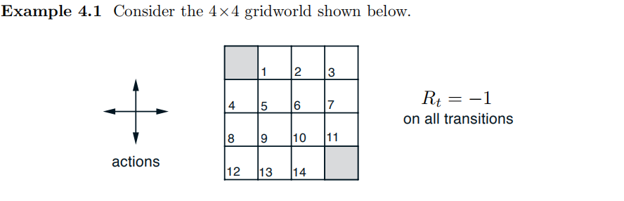
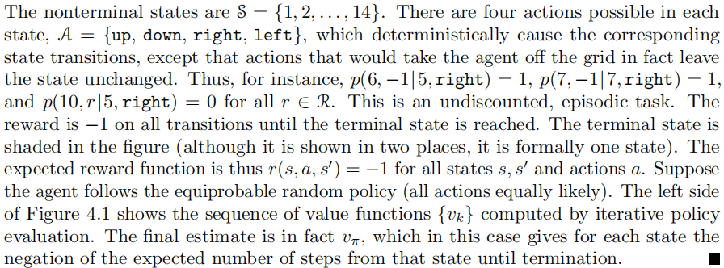
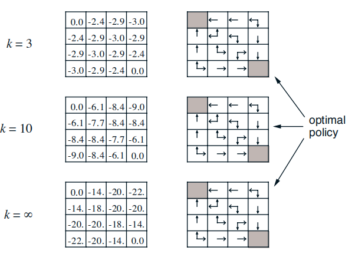

# 动态规划

## 策略评估

首先，我们考虑这样一个问题：对于任意一个策略$$\pi$$，如何计算其状态价值函数$$v_\pi$$

回顾上一章的内容，我们知道，$$v_\pi$$满足如下贝尔曼方程
$$
\begin{aligned}
v_{\pi}(s) & \doteq \mathbb{E}_{\pi}\left[G_{t} | S_{t}=s\right] \\
&=\mathbb{E}_{\pi}\left[R_{t+1}+\gamma G_{t+1} | S_{t}=s\right] \\
&=\mathbb{E}_{\pi}\left[R_{t+1}+\gamma v_{\pi}\left(S_{t+1}\right) | S_{t}=s\right] \\
&=\sum_{a} \pi(a | s) \sum_{s^{\prime}, r} p\left(s^{\prime}, r | s, a\right)\left[r+\gamma v_{\pi}\left(s^{\prime}\right)\right]
\end{aligned}
$$
当我们完全已知环境的动态特性时，那么上式就是一个有$$|\mathcal{S}|$$个未知数，$$|\mathcal{S}|$$个方程的方程组，因此我们可以弃用这个四参数函数$$p$$，而使用$$r(s,a)$$更便于理解
$$
\begin{aligned}
v_{\pi}(s) & \doteq \sum_{a} \pi(a | s) \left[r(s,a)+\gamma v_{\pi}\left(s^{\prime}\right)\right]
\end{aligned}
$$
对于这样一个庞大的方程组，直接求解是非常困难的，所以我们考虑使用迭代法逼近求解。考虑一个近似的价值函数序列$$v_{0}, v_{1}, v_{2}, \dots$$，对于任意$$s \in \mathcal{S}$$，有
$$
\begin{aligned}
v_{k+1}(s) & \doteq \mathbb{E}_{\pi}\left[R_{t+1}+\gamma v_{k}\left(S_{t+1}\right) | S_{t}=s\right] \\
&=\sum_{a} \pi(a | s) \sum_{s^{\prime}, r} p\left(s^{\prime}, r | s, a\right)\left[r+\gamma v_{k}\left(s^{\prime}\right)\right]\\
&=\sum_{a} \pi(a | s) \left[r(s,a)+\gamma v_{k}\left(s^{\prime}\right)\right]
\end{aligned}
$$
显然，$$v_{k}= v_{\pi}$$是这个更新规则的一个不动点，可以通过上面的贝尔曼方程保证。在保证$$v_{\pi}$$存在的条件下，$$k$$在趋于无穷时可以得到$$v_{\pi}$$。

下面，我们就可以得到这个迭代策略评估算法的伪代码，用于估计$$V \approx v_{\pi}$$

在每次遍历之后检查$$\max _{s \in \mathcal{S}}\left|v_{k+1}(s)-v_{k}(s)\right|$$是否足够小来决定是否停止迭代。

**例 4.1**

智能体采取等概率随机策略（上、下、左、右四个动作等概率执行）

当$$k=1$$时，对于所有的白色格子有
$$
\begin{aligned}
v_{1}(s) & \doteq \sum_{a} \pi(a | s) \left[r(s,a)+\gamma v_{2}\left(s^{\prime}\right)\right]\\
&=\sum_{i=1}^{4} \frac{1}{4} \left[(-1)+0.0\right]\\
&=-1
\end{aligned}
$$
当$$k=2$$时，仅分析第一行第二个格子，其他的状态同理
$$
\begin{aligned}
v_{2}(s) & \doteq \sum_{a} \pi(a | s) \left[r(s,a)+\gamma v_{1}\left(s^{\prime}\right)\right]\\
&= \frac{1}{4}\times \left[(-1)+(-1)\right]+\frac{1}{4}\times \left[(-1)+(-1)\right]+\frac{1}{4}\times \left[(0)+(-1)\right]+\frac{1}{4}\times \left[(-1)+(-1)\right]+\\
&=-1.7
\end{aligned}
$$

注意到，当$$k=3$$时，即可收敛得到最优策略，右边一系列图中的箭头表示价值最大的动作。

## 策略改进

通过上一小节的分析，我们对于任意一个策略$$\pi$$，都能够计算其状态价值函数$$v_\pi$$，那我们现在的问题是能不能找到一个策略$$\pi'$$使得$$v_{\pi^{\prime}}(s) \geq v_{\pi}(s)$$，也就是说，策略$$\pi'$$比策略$$\pi$$更好，或和策略$$\pi$$一样好。（这里我们讨论的是确定性策略$$a=\pi(s)$$，对于随机策略，采取的动作服从一个概率分布，即$$a\sim \pi(a|s)$$，事实上我们将要讨论的确定性策略能够很容易地推广到随机性策略。）

我们现在考虑这样这样一个策略：对于所有的状态，在每个状态下根据$$q_{\pi}(s, a)$$选择一个最优的动作。这样一个策略$$\pi'$$表示为
$$
\begin{aligned}
\pi^{\prime}(s) & \doteq \underset{a}{\arg \max } q_{\pi}(s, a) \\
&=\underset{a}{\arg \max } \mathbb{E}\left[R_{t+1}+\gamma v_{\pi}\left(S_{t+1}\right) | S_{t}=s, A_{t}=a\right] \\
&=\underset{a}{\arg \max } \sum_{s^{\prime}, r} p\left(s^{\prime}, r | s, a\right)\left[r+\gamma v_{\pi}\left(s^{\prime}\right)\right]
\end{aligned}
$$
我们知道价值函数$$v_\pi$$定义为
$$
\begin{aligned}
v_{\pi}(s) & \doteq \sum_{a} \pi(a | s) \sum_{s^{\prime}, r} p\left(s^{\prime}, r | s, a\right)\left[r+\gamma v_{\pi}\left(s^{\prime}\right)\right]
\end{aligned}
$$
那么可以容易地证明$$v_{\pi^{\prime}}(s) \geq v_{\pi}(s)$$

## 策略迭代

一旦一个策略$$\pi$$根据$$v_\pi$$产生了一个更好的策略$$\pi'$$，那么策略$$\pi'$$就可以根据$$v_{\pi'}$$再产生一个更好的策略$$\pi''$$，以此类推，我们就可以不断地改进我们的策略
$$
\pi_{0} \stackrel{\mathrm{E}}{\longrightarrow} v_{\pi_{0}} \stackrel{\mathrm{I}}{\longrightarrow} \pi_{1} \stackrel{\mathrm{E}}{\longrightarrow} v_{\pi_{1}} \stackrel{\mathrm{I}}{\longrightarrow} \pi_{2} \stackrel{\mathrm{E}}{\longrightarrow} \cdots \stackrel{\mathrm{I}}{\longrightarrow} \pi_{*} \stackrel{\mathrm{E}}{\longrightarrow} v_{*}
$$

- $$\stackrel{\mathrm{E}}{\longrightarrow}$$表示策略评估，对应下图绿色方框

- $$\stackrel{\mathrm{I}}{\longrightarrow}$$表示策略改进，对应下图蓝色方框

下图出自[CS285第7讲 Value Function Methods](http://rail.eecs.berkeley.edu/deeprlcourse/static/slides/lec-7.pdf)，图中的思路是几乎贯穿整个课程，作为RL一般框架。（在这一讲中，从*Policy iteration*算法到*Fitted Value Iteration*算法，然后引出了*Fitted Q-Iteration*算法以及*Online Q-iteration*算法）

*Policy iteration*算法完整伪代码

## 价值迭代

考虑策略迭代算法中策略评估这一步，要收敛到$$v_{\pi}$$理论上要到极限出才能成立，但事实上，策略评估只需要遍历有限若干步就可以收敛（如例4.1）。

当我们在一次遍历后立即停止策略评估，该算法成为价值迭代
$$
\begin{aligned}
v_{k+1}(s) & \doteq \max _{a} \mathbb{E}\left[R_{t+1}+\gamma v_{k}\left(S_{t+1}\right) | S_{t}=s, A_{t}=a\right] \\
&=\max _{a} \sum_{s^{\prime}, r} p\left(s^{\prime}, r | s, a\right)\left[r+\gamma v_{k}\left(s^{\prime}\right)\right]\\
&=\max _{a} \left[r(s,a)+\gamma v_{k}\left(s^{\prime}\right)\right]\\
&=\max _{a} q_{k}(s,a)
\end{aligned}
$$
上式，相当于把策略迭代伪代码中2、3步和为了一步，也可以将评估策略和改进策略分开表示，如下图所示

也可将价值迭代方法理解为将贝尔曼方程改写为一条更新规则。和策略评估一样，理论上价值迭代需要无限次才能收敛到$$\pi_*$$，实际中如果一次遍历价值函数仅有微小变化就可以停止迭代了。

价值迭代的伪代码

## 异步动态规划

我们之前讨论过的算法的主要缺点是，如果状态集很大，那么即使是单次遍历也十分昂贵。一个解决方法是，每一步只更新一个状态，如果在有折扣的情况下，只要所有的状态都能够出现无数次，就能保证收敛到$$v_*$$。

当然，避免遍历不一定会减少计算量，只是不需要陷入漫长而无望的遍历。我们可以选择一些“有价值”的动作更新价值函数，比如当智能体访问状态时更新。

## 广义策略迭代

广义策略迭代（GPI）指让策略评估和策略改进相互作用的一般思路，与这两个流程的粒度和其他细节无关。策略的改进要基于价值函数，而价值函数的更新会向着策略的真实价值收。当策略是对当前价值函数的贪心策略是，并且价值函数与策略一致时才稳定。

我们也可将GPI的评估和改进视为两个约束或目标之间的相互作用，每做一次评估或改进，都会向着其中一条线靠近。因为两条线彼此不是正交的，所以两个目标之间会相互作用，每次部分地实现一个目标，最终会达到最优的总目标。

