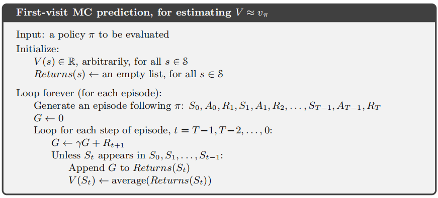
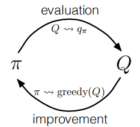
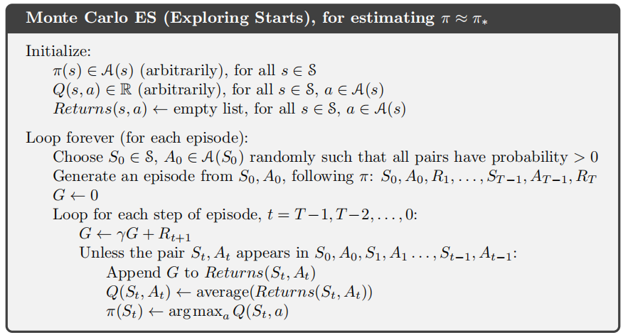
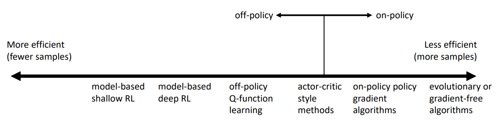
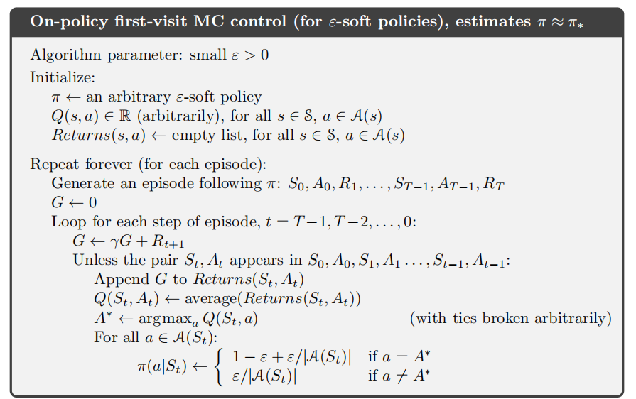
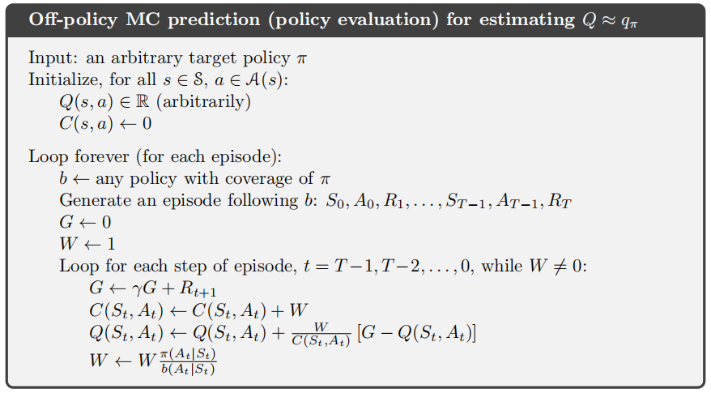
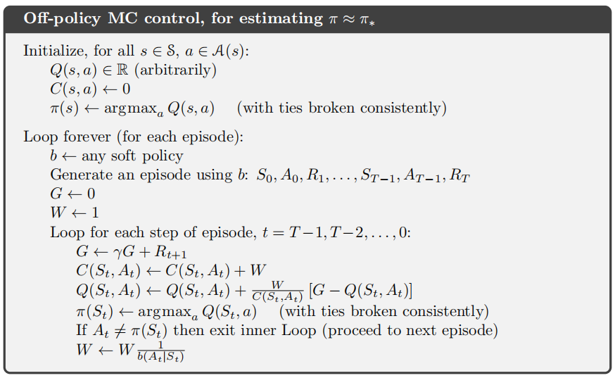

# 蒙特卡罗方法

## 蒙特卡罗预测

这里，我们假设不拥有完备的环境知识，不像DP那样知道所有的转移概率，而我们需要不断地和环境交互采样。

我们考虑这样一个问题，如何通过蒙特卡罗算法学习状态价值函数。我们可以进行大量的采样，然后求平均，随着观察样本的增多，平均值会收敛于期望值，这也是蒙特卡罗算法的基本思想。

对于一个分幕任务，在同一幕中，某一个状态$$s$$可能会多次访问。首次访问型MC算法用所有首次访问的回报的平均值估计$$v_\pi(s)$$，每次访问型MC算法用所有的访问的回报的平均值。

首次访问型MC预测算法的伪代码

蒙特卡罗算法和DP的区别

- 蒙特卡罗算法的一幕样本序列是一直到终止状态的完整轨迹，而DP只包含一步转移
- 蒙特卡罗算法的回溯图显示这一幕中的那些转移，DP的回溯图显示当前状态下所有可能的转移
- 蒙特卡罗算法对于每个状态的估计是孤立的，DP对于每个状态的估计依赖于其他状态（bootstrap）

## 动作价值的蒙特卡罗估计

如果无法得到环境的模型，那么计算动作价值比计算状态价值更有用。一个简单的估计动作价值的思路是，类似上一节价值函数的估计方法，选取包含特定“状态-动作”二元组的幕作为样本，计算其价值，再取平均，但是这个方法存在问题，如果执行的是一个确定性策略，那么某些“状态-动作二元组永远不会被访问到。所以，我们一定要保持“试探”。

一种方法是，从“状态-动作”二元组开始一幕采样，保证所有“状态-动作”二元组都有非0概率可以被选为起点，但是这种方法在实际中很难做到。

另一种方法是，只考虑那些在每个状态下所有动作都有非零概率被选中的策略。

## 蒙特卡罗控制

与上一章的策略迭代算法的思路类似，我们可以套用之前提到的GPI，使用蒙特卡罗估计解决控制问题。

使用策略$$\pi$$评估动作价值$$Q$$，使用动作价值$$Q$$来改进策略$$\pi$$

策略描述为，对于任意状态，必定选择对应动作价值最大的动作，这是一个确定性策略
$$
\pi(s) \doteq \arg \max _{a} q(s, a)
$$
可以证明，改进后的策略比原策略更好，或和原策略一样好
$$
\begin{aligned}
q_{\pi_{k}}\left(s, \pi_{k+1}(s)\right) &=q_{\pi_{k}}\left(s, \underset{a}{\arg \max } q_{\pi_{k}}(s, a)\right) \\
&=\max _{a} q_{\pi_{k}}(s, a) \\
& \geq q_{\pi_{k}}\left(s, \pi_{k}(s)\right) \\
& \geq v_{\pi_{k}}(s)
\end{aligned}
$$
为了 保证蒙特卡罗算法的收敛，需要做两个很强的假设

- 试探性出发（保证所有“状态-动作”二元组都有非0概率可以被选为起点）
- 进行策略评估时有无限多幕的样本序列进行试探

然而，为了使算法在实际中可用我们必须去除这两个假设

对于需要无限多幕的样本这一假设可以容易地去除，有两种方法。

第一种方法在评估时定一些测度，保证收敛到令人满意的近似水平即可

第二种方法比较极端，类似于上一章的价值迭代，只进行一次评估，而不要求多次迭代后的收敛，可以理解为“就地更新”。

我们先保留试探性出发的的假设，给出基于试探性出发（ES）的蒙特卡罗算法

上述算法的效率并不高，对于每个出现的"状态-动作"二元组，都要进行一次求平均值的运算。其实我们可以采取更高效的方式，只保存一个平均值和一个统计量（对每个"状态-动作"二元组），然后增量式地更新$$Q$$函数

## 没有试探性出发假设的蒙特卡罗控制

解决没有试探性出发假设的蒙特卡罗控制的唯一方法就是智能体能够不断地选择所有可能的动作。

可以使用on-policy（同轨策略）的方法或off-policy（离轨策略）的方法。他们的区别在于，用于和环境交互生成样本的策略和用于评估或改进的策略是否是相同的。

**注：** on-policy往往需要更多的样本，样本效率较低，而off-policy样本效率较高。但这并不意味着样本效率低的算法是“不好”的，比如进化算法或者在线的策略梯度算法可以做到并行，而有些基于模型的强化学习算法，即便充分利用了数据，但也需要大量的时间去拟合多个神经网络，进行反向传播，可能更加昂贵。下图举例了一些算法的效率（这个举例是非常粗糙的，具体效果依赖于特定的问题）

这里，我们先讨论on-policy（同轨策略）的MC控制方法，在on-policy中，策略一般是soft（软性的），也就是说，对于任意的状态和任意的动作，都有$$\pi(a|s)>0$$，但他们都很逼近一个确定性策略（通过策略改进）。这里我们介绍的on-policy方法是$$\epsilon-$$贪心策略，对于贪心动作，有$$1-\varepsilon+\frac{\varepsilon}{|\mathcal{A}(s)|}$$的概率被选中；对于非贪心的动作，有$$\frac{\varepsilon}{|\mathcal{A}(s)|}$$的概率被选中，这样就能够保证对于所有的状态和动作都有$$\pi(a | s) \geq \frac{\varepsilon}{|\mathcal{A}(s) |}$$

on-policy的MC控制的总体思想依旧是GPI，由于on-policy通常保证了对于任意的状态和任意的动作，都有$$\pi(a|s)>0$$，所以我们可以弃用试探性出发的方法，对此，策略改进的方式也要有所调整，改进后的策略也应该是soft的（$$\epsilon-$$贪心）

给出一个on-policy的首次访问型MC控制算法

可以证明，这样的策略改进方式，能够保证$$\pi^{\prime} \geq \pi\left(\text { i.e., }, v_{\pi^{\prime}}(s) \geq v_{\pi}(s), \text { for all } s \in \mathcal{S}\right)$$
$$
\begin{aligned}
q_{\pi}\left(s, \pi^{\prime}(s)\right) &=\sum_{a} \pi^{\prime}(a | s) q_{\pi}(s, a) \\
&=\frac{\varepsilon}{|\mathcal{A}(s)|} \sum_{a} q_{\pi}(s, a)+(1-\varepsilon) \max _{a} q_{\pi}(s, a) \\
& \geq \frac{\varepsilon}{|\mathcal{A}(s)|} \sum_{a} q_{\pi}(s, a)+(1-\varepsilon) \sum_{a} \frac{\pi(a | s)-\frac{\varepsilon}{|\mathcal{A}(s)|}}{1-\varepsilon} q_{\pi}(s, a)\\
&=\frac{\varepsilon}{|\mathcal{A}(s)|} \sum_{a} q_{\pi}(s, a)-\frac{\varepsilon}{|\mathcal{A}(s)|} \sum_{a} q_{\pi}(s, a)+\sum_{a} \pi(a | s) q_{\pi}(s, a)\\
&=v_{\pi}(s)
\end{aligned}
$$

## 基于重要度采样的离轨策略

所有的学习控制方法都面临一个困境：它们希望学到最优的动作，但是为了找到最优动作，又必须探索其他非最优动作。

on-policy的方法实际上是一种妥协，他并不学习最优策略的动作值，而是学习一个接近最优而又能进行试探的策略的动作值。

off-policy的方法则是干脆采用两个策略，用来和环境交互采样的策略更具有试探性，称为**行动策略**，另一个用来学习并最终要成为最优策略的成为**目标策略**。

由于off-policy的方法中的采样来源于另一个策略，所以off-policy的方法的方差更大（这里方差并不是指某个行为的概率分布，而是指整个每一幕的轨迹会产生更加多变的结果）

我们把目标策略记作$$\pi$$，通常是一个确定性的贪心策略；把行动策略记作$$b$$，通常是一个具有试探性的策略（如$$\epsilon-$$贪心）。

由于采样是从$$b$$决定的概率分布中取得，而评估（如估计价值函数）则是使用$$\pi$$，所以，在这里需要用到**重要度采样**。

假设我们要估计$$f(x)$$的期望值，其中$$x$$是服从分布$$p(x)$$的。此时，假如我们知道另一个分布$$q(x)$$，那么我们可以从$$q(x)$$抽样，间接估计$$x$$服从分布$$p(x)$$时$$f(x)$$的期望值
$$
\begin{aligned}
E_{x \sim p(x)}[f(x)] &=\int p(x) f(x) d x \\
&=\int \frac{q(x)}{q(x)} p(x) f(x) d x \\
&=\int q(x) \frac{p(x)}{q(x)} f(x) d x \\
&=E_{x \sim q(x)}\left[\frac{p(x)}{q(x)} f(x)\right]
\end{aligned}
$$
（off-policy版的梯度策略算法也应用了重要度采样，是PPO、TRPO算法的核心，可以参考[李宏毅老师的讲解](https://youtu.be/OAKAZhFmYoI)）

设状态-动作轨迹为$$\tau \doteq {A_{t}, S_{t+1}, A_{t+1}, \ldots, S_{T}}$$，把使用策略$$\pi$$产生某条轨迹的概率记为$$\pi(\tau)$$，同理，把使用策略$$b$$产生某条轨迹的概率记为$$b(\tau)$$。

其中$$\pi(\tau)$$可以展开为
$$
\begin{array}{l}
\pi(\tau)\\
\quad=\operatorname{Pr}\left\{A_{t}, S_{t+1}, A_{t+1}, \ldots, S_{T} | S_{t}, A_{t: T-1} \sim \pi\right\} \\
\quad=\pi\left(A_{t} | S_{t}\right) p\left(S_{t+1} | S_{t}, A_{t}\right) \pi\left(A_{t+1} | S_{t+1}\right) \cdots p\left(S_{T} | S_{T-1}, A_{T-1}\right) \\
\quad=\prod_{k=t}^{T-1} \pi\left(A_{k} | S_{k}\right) p\left(S_{k+1} | S_{k}, A_{k}\right)
\end{array}
$$
将$$\pi(\tau)$$和$$b(\tau)$$的比值称为相对概率（重要度采样比）,记作$$\rho_{t: T-1}$$
$$
\rho_{t: T-1} \doteq \frac{\pi(\tau)}{b(\tau)}= \frac{\prod_{k=t}^{T-1} \pi\left(A_{k} | S_{k}\right) p\left(S_{k+1} | S_{k}, A_{k}\right)}{\prod_{k=t}^{T-1} b\left(A_{k} | S_{k}\right) p\left(S_{k+1} | S_{k}, A_{k}\right)}=\prod_{k=t}^{T-1} \frac{\pi\left(A_{k} | S_{k}\right)}{b\left(A_{k} | S_{k}\right)}
$$
我们可以按照策略$$b$$采样，用来估计在策略$$\pi$$下的价值函数$$v_\pi(s)$$
$$
\begin{aligned}
v_\pi(s)
&\doteq \mathbb{E}_{\pi}\left[G_{t} | S_{t}=s\right] \\
&=\mathbb{E}_{b}\left[\rho_{t: T-1}G_{t} | S_{t}=s\right] \\
\end{aligned}
$$
为了预测$$v_\pi(s)$$，我们只需要根据重要度采样调整回报值并对结果取平均即可，成为**普通重要度采样**。其中，$$T(t)$$表示$$t$$时刻后的首次（幕）终止的时刻，$$\mathcal{T}(s)$$表示所有访问过状态$$s$$的时刻的集合
$$
V(s) \doteq \frac{\sum_{t \in \mathcal{T}(s)} \rho_{t: T(t)-1} G_{t}}{|\mathcal{T}(s)|}
$$
另一种方法是**加权重要度采样**，$$\rho_{t: T(t)-1} $$为权重
$$
V(s) \doteq \frac{\sum_{t \in \mathcal{T}(s)} \rho_{t: T(t)-1} G_{t}}{\sum_{t \in \mathcal{T}(s)} \rho_{t: T(t)-1}}
$$
对于加权重要度采样，其期望是$$v_b(s)$$，而不是$$v_\pi(s)$$，所以这个估计是有偏的。

对于普通重要度采样，其期望是无偏的，但是可能导致距离真实观测到的回报值，相差悬殊；而且其方差是无界的，因为采样比的方差是无界的（原因详见例5.5的分析）。

**注：**PPO和TRPO算法都要求目标策略和动作策略要尽可能接近，通过使两个策略的参数$$\theta_\pi$$和$$\theta_b$$的[KL散度]([https://zh.wikipedia.org/wiki/%E7%9B%B8%E5%AF%B9%E7%86%B5](https://zh.wikipedia.org/wiki/相对熵))尽可能小

## 增量式实现

我们采用**加权**重要度采样的方法
$$
V_{n} \doteq \frac{\sum_{k=1}^{n-1} W_{k} G_{k}}{\sum_{k=1}^{n-1} W_{k}}, \quad n \geq 2
$$
改写为增量式实现
$$
\begin{aligned}
&V_{n+1} \doteq V_{n}+\frac{W_{n}}{C_{n}}\left[G_{n}-V_{n}\right], \quad n \geq 1\\
&C_{n+1} \doteq C_{n}+W_{n+1}
\end{aligned}
$$
这里$$C_{0} =0$$（因为$$V_1$$是任意的，所以不用特别指定），下面给出一个off-policy的MC预测算法，用于估计$$q_\pi$$，这个算法同样适用于on-policy，只需$$\pi=b,W=1$$

## 离轨策略蒙特卡罗控制

下面给出一个基于加权重要度采样的离轨策略MC控制方法，$\pi$是一个确定性的贪心策略，$$b$$是一个软性策略

$$W$$的更新应该采用$$\frac{\pi\left(A_{t} | S_{t}\right)}{b\left(A_{t} | S_{t}\right)}$$，是实际上却采用$$\frac{1}{b\left(A_{t} | S_{t}\right)}$$，因为$$\pi$$是一个确定性策略，$$\pi\left(A_{t} | S_{t}\right)$$的值恒为$$1$$。

如果非贪心的行为较为普遍，则学习的速度会很慢，下一章的时序差分学习将分析如何处理这个问题。

## * 折扣敏感的重要采样

假设这样一种情况，幕持续100步，且$$\gamma=0$$，那么$$0$$时刻的回报就是$$G_0=R_1$$，但它的采样比却是100个因子之积，即
$$
\frac{\pi\left(A_{0} | S_{0}\right)}{b\left(A_{0} | S_{0}\right)} \frac{\pi\left(A_{1} | S_{1}\right)}{b\left(A_{1} | S_{1}\right)} \cdot \cdot \cdot \frac{\pi\left(A_{99} | S_{99}\right)}{b\left(A_{99} | S_{99}\right)}
$$
事实上我么嗯只需要按第一个因子来衡量即可，另外99个因子都是无关的，因为在首次收益之后，整个幕的收益就已经决定了，后面这些因子会极大的增加方差。

为了解决这一问题，我们需要把折扣$$\gamma$$看作幕终止的概率，或者说“部分终止”的程度

在第1步内，以$$1-\gamma$$的概率部分终止。产生的回报为$$R_0$$

在第2步内，以$$(1-\gamma)\gamma$$的概率部分终止。产生的回报为$$R_0+R_1$$

在第3步内，以$$(1-\gamma)\gamma^2$$的概率部分终止。产生的回报为$$R_0+R_1+R_2$$

以此类推，可得
$$
\begin{aligned}
G_{t} \doteq & R_{t+1}+\gamma R_{t+2}+\gamma^{2} R_{t+3}+\cdots+\gamma^{T-t-1} R_{T} \\
=&(1-\gamma) R_{t+1} \\
&+(1-\gamma) \gamma\left(R_{t+1}+R_{t+2}\right) \\
&+(1-\gamma) \gamma^{2}\left(R_{t+1}+R_{t+2}+R_{t+3}\right) \\
& \vdots \\
&+(1-\gamma) \gamma^{T-t-2}\left(R_{t+1}+R_{t+2}+\cdots+R_{T-1}\right) \\
&+\gamma^{T-t-1}\left(R_{t+1}+R_{t+2}+\cdots+R_{T}\right) \\
=&(1-\gamma) \sum_{h=t+1}^{T-1} \gamma^{h-t-1} \bar{G}_{t: h}+\gamma^{T-t-1} \bar{G}_{t: T}
\end{aligned}
$$
其中$$\bar{G}_{t \cdot h}$$表示**平价部分回报**，即没有折扣的并非延续到幕终止的回报
$$
\bar{G}_{t \cdot h} \doteq R_{t+1}+R_{t+2}+\cdots+R_{h}, \quad 0 \leq t<h \leq T
$$
定义**普通折扣敏感的重要度采样估计器**
$$
V(s) \doteq \frac{\sum_{t \in \mathcal{T}(s)}\left((1-\gamma) \sum_{h=t+1}^{T(t)-1} \gamma^{h-t-1} \rho_{t: h-1} \bar{G}_{t: h}+\gamma^{T(t)-t-1} \rho_{t: T(t)-1} \bar{G}_{t, T(t)}\right)}{|\mathcal{T}(s)|}
$$
由于$$\bar{G}_{t \cdot h}$$只涉及到$$t$$到视界$$h$$的收益，所以采样比为$$\rho_{t: h-1}$$

以及**加权折扣敏感的重要度采样估计器**
$$
V(s) \doteq \frac{\sum_{t \in \mathcal{T}(s)}\left((1-\gamma) \sum_{h=t+1}^{T(t)-1} \gamma^{h-t-1} \rho_{t: h-1} \bar{G}_{t: h}+\gamma^{T(t)-t-1} \rho_{t: T(t)-1} \bar{G}_{t: T(t)}\right)}{\sum_{t \in \mathcal{T}(s)}\left((1-\gamma) \sum_{h=t+1}^{T(t)-1} \gamma^{h-t-1} \rho_{t: h-1}+\gamma^{T(t)-t-1} \rho_{t: T(t)-1}\right)}
$$

## * 每次决策型重要度采样

在普通重要度采样估计器$$V(s) \doteq \frac{\sum_{t \in \mathcal{T}(s)} \rho_{t: T(t)-1} G_{t}}{|\mathcal{T}(s)|}$$中，分子中求和的项实际上也是一个求和的形式
$$
\begin{aligned}
\rho_{t: T-1} G_{t} &=\rho_{t: T-1}\left(R_{t+1}+\gamma R_{t+2}+\cdots+\gamma^{T-t-1} R_{T}\right) \\
&=\rho_{t: T-1} R_{t+1}+\gamma \rho_{t: T-1} R_{t+2}+\cdots+\gamma^{T-t-1} \rho_{t: T-1} R_{T}
\end{aligned}
$$
可以将第一个子项写为
$$
\rho_{t: T-1} R_{t+1}=\frac{\pi\left(A_{t} | S_{t}\right)}{b\left(A_{t} | S_{t}\right)} \frac{\pi\left(A_{t+1} | S_{t+1}\right)}{b\left(A_{t+1} | S_{t+1}\right)} \frac{\pi\left(A_{t+2} | S_{t+2}\right)}{b\left(A_{t+2} | S_{t+2}\right)} \cdots \frac{\pi\left(A_{T-1} | S_{T-1}\right)}{b\left(A_{T-1} | S_{T-1}\right)} R_{t+1}
$$
可以注意到这些因子中，只有第一项$$\frac{\pi\left(A_{t} | S_{t}\right)}{b\left(A_{t} | S_{t}\right)}$$和收益$$R_{t+1}$$是相关的，对于其他因子，求其期望可得
$$
\mathbb{E}\left[\frac{\pi\left(A_{k} | S_{k}\right)}{b\left(A_{k} | S_{k}\right)}\right] \doteq \sum_{a} b\left(a | S_{k}\right) \frac{\pi\left(a | S_{k}\right)}{b\left(a | S_{k}\right)}=\sum_{a} \pi\left(a | S_{k}\right)=1
$$
由于独立随机变量乘积的期望是变量期望值的乘机，所以有
$$
\mathbb{E}\left[\rho_{t: T-1} R_{t+1}\right]=\frac{\pi\left(A_{t} | S_{t}\right)}{b\left(A_{t} | S_{t}\right)}R_{t+1} = \mathbb{E}\left[\rho_{t: t} R_{t+1}\right]\\
\mathbb{E}\left[\rho_{t: T-1} R_{t+2}\right]=\frac{\pi\left(A_{t} | S_{t}\right)}{b\left(A_{t} | S_{t}\right)}\frac{\pi\left(A_{t+1} | S_{t+1}\right)}{b\left(A_{t+1} | S_{t+1}\right)}R_{t+2} = \mathbb{E}\left[\rho_{t: t+1} R_{t+2}\right]\\
\mathbb{E}\left[\rho_{t: T-1} R_{t+3}\right]=\frac{\pi\left(A_{t} | S_{t}\right)}{b\left(A_{t} | S_{t}\right)}\frac{\pi\left(A_{t+1} | S_{t+1}\right)}{b\left(A_{t+1} | S_{t+1}\right)}\frac{\pi\left(A_{t+2} | S_{t+2}\right)}{b\left(A_{t+2} | S_{t+2}\right)}R_{t+3} = \mathbb{E}\left[\rho_{t: t+2} R_{t+3}\right]\\
$$
以此类推，可得
$$
\mathbb{E}\left[\rho_{t: T-1} R_{t+k}\right]=\mathbb{E}\left[\rho_{t: t+k-1} R_{t+k}\right]=\mathbb{E}\left[\tilde{G}_{t}\right]
$$
其中
$$
\tilde{G}_{t}=\rho_{t: t} R_{t+1}+\gamma \rho_{t: t+1} R_{t+2}+\gamma^{2} \rho_{t: t+2} R_{t+3}+\cdots+\gamma^{T-t-1} \rho_{t: T-1} R_{T}
$$
于是我们可到**每次决策型重要度采样**已减少方差
$$
V(s) \doteq \frac{\sum_{t \in \mathcal{T}(s)} \tilde{G}_{t}}{|\mathcal{T}(s)|}
$$
