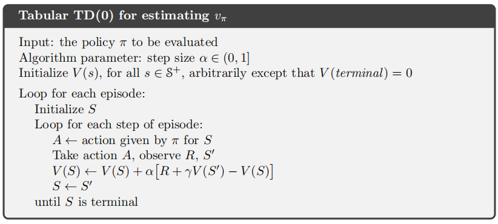
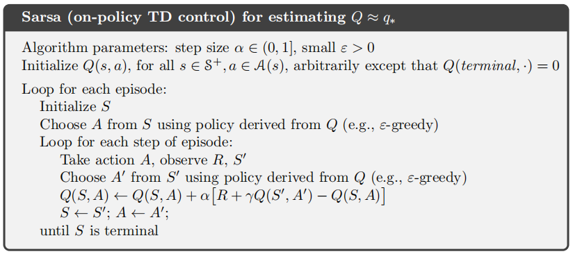
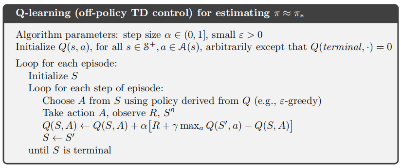
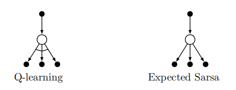
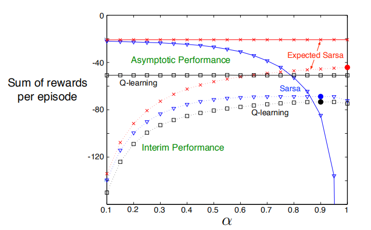
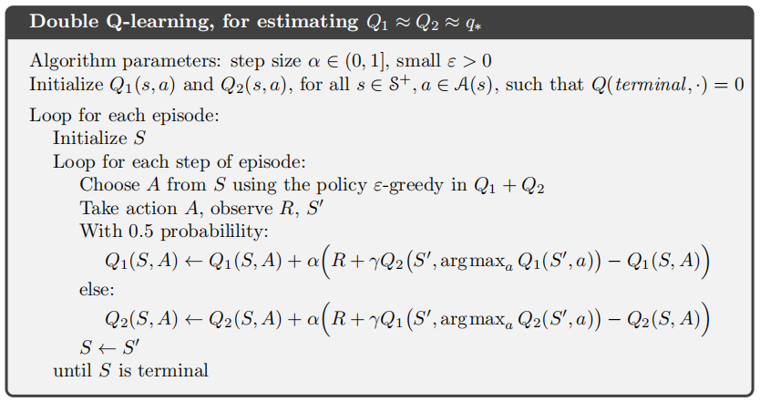
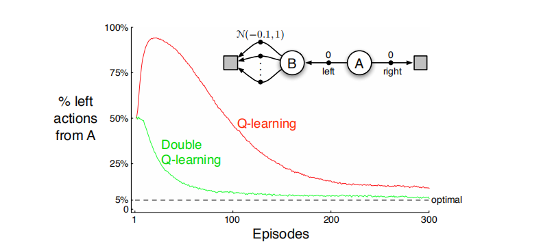

# 时序差分学习

## 时序差分预测

根据之前的讨论，MC方法在估计价值函数时采用的更新方式为
$$
V\left(S_{t}\right) \leftarrow V\left(S_{t}\right)+\alpha\left[G_{t}-V\left(S_{t}\right)\right]
$$
而TD（Temporal-Difference）方法，使用观察到的收益和估计值进行更新
$$
V\left(S_{t}\right) \leftarrow V\left(S_{t}\right)+\alpha\left[R_{t+1}+\gamma V\left(S_{t+1}\right)-V\left(S_{t}\right)\right]
$$
这种更新方法称为**TD(0)**，其估计的过程依赖于已存在的估计值，类似于DP，也是一种bootstrap（自举法）

下面给出表格型TD(0)算法，用于估计价值函数的伪代码

从价值函数的定义可以看出MC方法和TD(0)方法的区别
$$
\begin{aligned}
v_{\pi}(s) & \doteq \mathbb{E}_{\pi}\left[G_{t} | S_{t}=s\right] \\
&=\mathbb{E}_{\pi}\left[R_{t+1}+\gamma G_{t+1} | S_{t}=s\right] \\
&=\mathbb{E}_{\pi}\left[R_{t+1}+\gamma v_{\pi}\left(S_{t+1}\right) | S_{t}=s\right]
\end{aligned}
$$
MC方法把第一步的目标作为估计值，而TD(0)方法把第三步的目标作为估计值，TD方法又融合了DP自举法，因此TD方法可以很好地结合MC方法和DP方法的优势。

我们把MC方法和TD方法使用的更新成为**采样更新**（基于单个后继节点的样本数据），把DP方法的更新称为**期望更新**（基于所有后继节点的完整分布）。

需要注意在TD(0)更新的中括号中的值称为**TD误差**，记为$$\delta_{t}$$，衡量了估计值$$V\left(S_{t}\right)$$和更好的估计$$R_{t+1}+\gamma V\left(S_{t+1}\right)$$之间的差异
$$
\delta_{t} \doteq R_{t+1}+\gamma V\left(S_{t+1}\right)-V\left(S_{t}\right)
$$
蒙特卡罗误差也可写为TD误差之和
$$
\begin{aligned}
G_{t}-V\left(S_{t}\right)&=R_{t+1}+\gamma G_{t+1}-V\left(S_{t}\right)+\gamma V\left(S_{t+1}\right)-\gamma V\left(S_{t+1}\right) \quad  \\
&=\delta_{t}+\gamma\left(G_{t+1}-V\left(S_{t+1}\right)\right) \\
&=\delta_{t}+\gamma \delta_{t+1}+\gamma^{2}\left(G_{t+2}-V\left(S_{t+2}\right)\right) \\
&=\delta_{t}+\gamma \delta_{t+1}+\gamma^{2} \delta_{t+2}+\cdots+\gamma^{T-t-1} \delta_{T-1}+\gamma^{T-t}\left(G_{T}-V\left(S_{T}\right)\right) \\
&=\delta_{t}+\gamma \delta_{t+1}+\gamma^{2} \delta_{t+2}+\cdots+\gamma^{T-t-1} \delta_{T-1}+\gamma^{T-t}(0-0) \\
&=\sum_{k=t}^{T-1} \gamma^{k-t} \delta_{k}

\end{aligned}
$$
上面式子中的$$V$$表示误差公式中用到的状态价值的书组，如果$$V$$在幕中发生变化，那么上式蒙特卡罗误差只能近似成立，真正的蒙特卡罗误差的推导为
$$
\begin{aligned}
\delta_{t} &=R_{t+1}+\gamma V_{t}\left(S_{t+1}\right)-V_{t}\left(S_{t}\right) \\ \\
G_{t}-V_{t}\left(S_{t}\right) &=R_{t+1}+\gamma G_{t+1}-V_{t}\left(S_{t}\right) \\
&=\delta_{t}+\gamma\left[G_{t+1}-V_{t+1}\left(S_{t+1}\right)\right]+\gamma\left[V_{t+1}\left(S_{t+1}\right)-V_{t}\left(S_{t+1}\right)\right] \\
&=\delta_{t}+\gamma\left[G_{t+1}-V_{t+1}\left(S_{t+1}\right)\right]+\alpha \gamma\left[R_{t+2}+\gamma V_{t}\left(S_{t+2}\right)-V_{t}\left(S_{t+1}\right)\right] \\
& \vdots \\
&=\sum_{k=t}^{T-1} \gamma^{k-t} \delta_{k}+\alpha \sum_{k=t}^{T-2} \gamma^{k-t+1}\left[R_{k+2}+\gamma V_{k}\left(S_{k+2}\right)-V_{k}\left(S_{k+1}\right)\right]
\end{aligned}
$$

## 时序差分预测方法的优势

相比DP算法，它不需要一个环境模型，即描述收益和下个状态联合概率分布的模型。

相比MC算法，它的实现是在线的、递增的，而不需要等到一幕的结束，可以应用在幕非常长或持续性任务中。

TD方法在随机任务上通常比常量$$\alpha$$MC方法收敛得更快。（例6.2展示了两种方法比较的结果）

## TD(0)的最优性

假设只有有限的经验，使用增量学习的方法一般是反复地呈现这些经验，直到收敛为止。对于所有非终止时刻$$t$$，根据公式$$G_{t}-V\left(S_{t}\right)$$或$$R_{t+1}+\gamma V\left(S_{t+1}\right)-V\left(S_{t}\right)$$计算这些增量，然后根据这些增量的和更新一次估计价值函数$$V$$，然后用新的价值函数再次处理这些经验，产生新的增量，以此类推，知道收敛，这种方法称为**批量更新**

在批量更新下，只要选择足够小的步长参数$$\alpha$$，TD(0)就能收敛到与$$\alpha$$无关的唯一结果。

如果$$n$$是状态数，那么建立过程的极大似然估计就可能需要$$n^2$$的内存，如果按传统方法（MC），计算相应地价值函数则需要$$n^3$$数量级的步骤。相比之下，TD方法可以使用不超过$$n$$的内存，并且通过在训练集上反复计算来逼近同样的答案。

## Sarsa: 同轨策略想啊的时序差分控制

我们仍然遵循GPI的模式，只不过在评估份的部分使用时序差分法。和MC方法一样，我们也要考虑试探和开发之间的tradeoff，我们可以使用$$\epsilon-$$贪心或$$\epsilon-$$软性策略，可以令$$\epsilon=1/t$$来实现。

整个更新规则依赖于五元组$$\left(S_{t}, A_{t}, R_{t+1}, S_{t+1}, A_{t+1}\right)$$中的所有元素，如果$$S_{t+1}$$是终止状态，那么$$Q\left(S_{t+1}, A_{t+1}\right)\doteq0$$
$$
Q\left(S_{t}, A_{t}\right) \leftarrow Q\left(S_{t}, A_{t}\right)+\alpha\left[R_{t+1}+\gamma Q\left(S_{t+1}, A_{t+1}\right)-Q\left(S_{t}, A_{t}\right)\right]
$$
下面给出Sarsa算法的伪代码，这是一个on-policy的算法

## Q学习：离轨策略下的时序差分控制

Q学习的更新方式为
$$
Q\left(S_{t}, A_{t}\right) \leftarrow Q\left(S_{t}, A_{t}\right)+\alpha\left[R_{t+1}+\gamma \max _{a} Q\left(S_{t+1}, a\right)-Q\left(S_{t}, A_{t}\right)\right]
$$
直接选用最优动作的价值函数作为学习目标，注意$$\max _{a} Q\left(S_{t+1}, a\right)$$这一项是与$$A_{t+1}$$无关的，这一点与Sarsa不同，也就是说Sarsa的采样数据一定是和学习目标（动作价值函数）是相关的，而Sarsa的策略是基于这个价值函数的；而Q学习不需要知道$$A_{t+1}$$，我们可以理解为我们事先用某种策略采样收集到了大量的状态-动作二元组，然后就可以更新学习目标（动作价值函数）了，我们要改进的策略是基于这个学习目标的，$$\max _{a}$$这一步其实就是在改进策略，某种意义上讲动作价值函数是对策略的一个解耦合。

下面是Q学习（off-policy的TD控制）的伪代码

这里循环每次只进行一轮的话，需要继续采样，就变成了online版的Q学习算法

## 期望Sarsa

上面介绍了Sarsa和Q学习，我们可以把Sarsa理解为是一个“保守的算法”，把Q学习理解为是一个“激进的算法”。那么这一节介绍的期望Sarsa则可以理解为是一个“理性的算法”。虽然它的名字叫做期望Sarsa，但是它更像是Q学习，因为它和Q学习一样，都去除了对$$A_{t+1}$$的依赖。

期望Sarsa的更新规则如下
$$
\begin{aligned}
Q\left(S_{t}, A_{t}\right) & \leftarrow Q\left(S_{t}, A_{t}\right)+\alpha\left[R_{t+1}+\gamma \mathbb{E}_{\pi}\left[Q\left(S_{t+1}, A_{t+1}\right) | S_{t+1}\right]-Q\left(S_{t}, A_{t}\right)\right] \\
& \leftarrow Q\left(S_{t}, A_{t}\right)+\alpha\left[R_{t+1}+\gamma \sum_{a} \pi\left(a | S_{t+1}\right) Q\left(S_{t+1}, a\right)-Q\left(S_{t}, A_{t}\right)\right]
\end{aligned}
$$
假设目标策略$$\pi$$是一个贪心策略，行动策略是一个探索性策略，那么此时期望Sarsa和Q学习完全相同。从这个角度，我们可以说期望Sarsa推广了Q学习，Q学习是期望Sarsa的一个特例。

Q学习和期望Sarsa的回溯图如下

下图展示了Sarsa、Q学习和期望Sarsa在“悬崖边行走”（例6.6）这个任务中的表现，可以看出期望Sarsa好于Sarsa和Q学习。

## 最大化偏差与双学习

我们目前讨论的所有的控制算法在构建目标策略时都包含了最大化操作，例如Q学习的更新规则，及时$$\epsilon-$$贪心算法也包含了最大化操作，这样在估计值时会产生一个显著的正偏差。

我们使用两个Q函数，来解决这个最大化偏差的问题，进行如下的更新
$$
Q_{1}\left(S_{t}, A_{t}\right) \leftarrow Q_{1}\left(S_{t}, A_{t}\right)+\alpha\left[R_{t+1}+\gamma Q_{2}\left(S_{t+1}, \arg \max _{a} Q_{1}\left(S_{t+1}, a\right)\right)-Q_{1}\left(S_{t}, A_{t}\right)\right]
$$
通过$$Q_1$$来选择最优的动作$$A_*=\arg \max _{a} Q_{1}(S_{t+1}, a)$$，再通过$$Q_2$$来评估价值$$Q_{2}(S_{t+1}, A_*)$$ 。这样，假如$$Q_1$$做了一个有误差的估计，那么$$Q_2$$就会平衡这个误差。为了形象化理解$$Q_1$$和$$Q_2$$的关系，李宏毅把它们和立法和行政类比，$$Q_1$$负责提案，而$$Q_2$$负责执行。这就是**双学习**的思想，这个思想也可以应用到Sarsa或期望Sarsa中。

下面给出双Q学习的伪代码，用于估计价值函数

下图展示了Q学习和双Q学习在一个简单的分幕式MDP中的对比

