# n步自举法

## n步时序差分预测

之前两章介绍了MC和TD方法的更新方式：MC方法根据从某一状态到终止状态所获得的收益对价值函数进行更新，而TD方法则是根据后面的单个即时收益和后继状态的价值估计来进行价值函数的更新。

**n步时序差分**就是介于MC和TD之间的一种方法，它对于价值函数的更新依据的是多于一个时刻的收益，但又不是到终止状态的所有收益。

下图展示了n步方法的回溯图，这些方法构成了一个从单步TD到MC的方法族

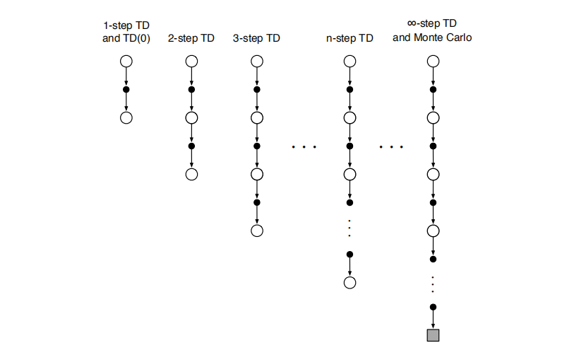

在MC方法中，依据的完整回报定义为
$$
G_{t} \doteq R_{t+1}+\gamma R_{t+2}+\gamma^{2} R_{t+3}+\cdots+\gamma^{T-t-1} R_{T}
$$
在单步TD方法中，依据的**单步回报**定义为
$$
G_{t: t+1} \doteq R_{t+1}+\gamma V_{t}\left(S_{t+1}\right)
$$
在两步TD方法中，依据的**两步回报**定义为
$$
G_{t: t+2} \doteq R_{t+1}+\gamma R_{t+2}+\gamma^{2} V_{t+1}\left(S_{t+2}\right)
$$
类似地，n步回报定义为
$$
G_{t: t+n} \doteq R_{t+1}+\gamma R_{t+2}+\cdots+\gamma^{n-1} R_{t+n}+\gamma^{n} V_{t+n-1}\left(S_{t+n}\right)
$$
由此，我们可以得到n步时序差分方法的价值函数的更新方式
$$
V_{t+n}\left(S_{t}\right) \doteq V_{t+n-1}\left(S_{t}\right)+\alpha\left[G_{t: t+n}-V_{t+n-1}\left(S_{t}\right)\right], \quad 0 \leq t<T
$$
**注：**这里$$V_{t+n}\left(S_{t}\right)$$和$$V_{t+n-1}\left(S_{t}\right)$$的下标是不一样，书中这样写只是区别表示在不同时刻作出的预测，本质上还是对$$V$$的更新，写作下面的形式更便于理解
$$
V\left(S_{t}\right) \leftarrow V\left(S_{t}\right)+\alpha\left[G_{t: t+n}-V\left(S_{t}\right)\right], \quad 0 \leq t<T
$$
注意，在最开始的$$n-1$$个时刻，价值函数不会被更新。为了弥补这个损失，在终止时还将进行对应次数的更新

n步时序差分算法的伪代码如下

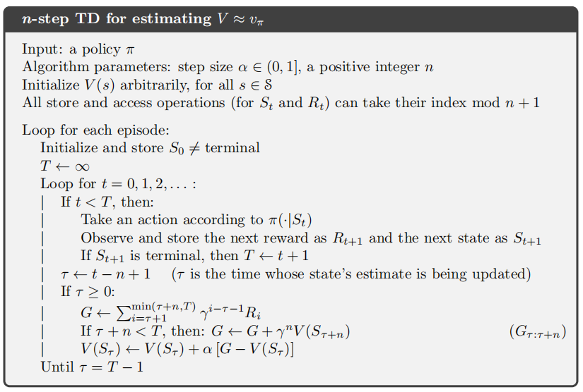

n步回报$$G_{t: t+n}$$的一个重要性质是：在最坏情况下，采用n步回报的期望值作为对价值函数$$v_\pi$$的估计可以保证比$$V_{t+n-1}$$更好。这个性质也被称为n步回报的误差减少性质
$$
\max _{s}\left|\mathbb{E}_{\pi}\left[G_{t: t+n} | S_{t}=s\right]-v_{\pi}(s)\right| \leq \gamma^{n} \max _{s}\left|V_{t+n-1}(s)-v_{\pi}(s)\right|
$$
例7.1展示了在19个状态的随机游走任务中，对于不同的$$n$$，作为$$\alpha$$的函数的n步时序差分法的性能（使用均方误差衡量）

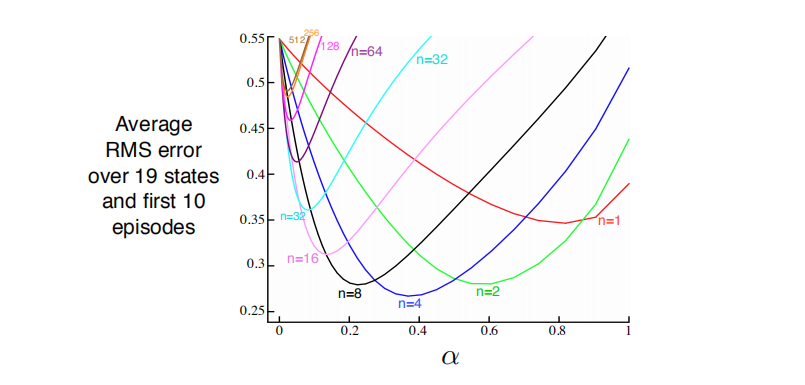

证明了时序差分算法和MC方法推广到n步时序差分方法可能会得到更好的结果。

## n步Sarsa

类似n步时序差分算法，将状态替换为状态-动作二元组，将对价值函数$$V$$的估计替换为对动作价值函数$$Q$$的估计，就得到了n步Sarsa算法

下图展示了基于状态-动作二元组的n步方法的回溯图，这些方法构成了一个从单步更新的Sarsa(0)到基于终止状态更新的MC算法的算法族。

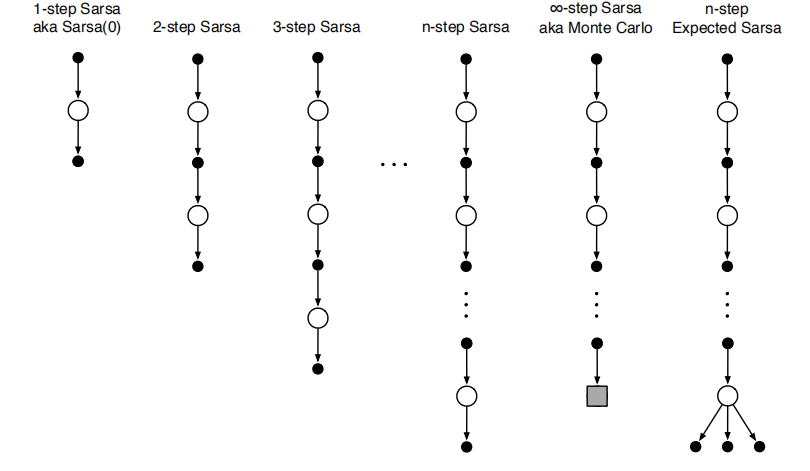

注意x的回溯图以动作结尾，而不是状态，这和n步时序差分的回溯图不同

我们可以得到n步Sarsa对于动作价值函数$$q_\pi$$的估计的更新方式
$$
Q_{t+n}\left(S_{t}, A_{t}\right) \doteq Q_{t+n-1}\left(S_{t}, A_{t}\right)+\alpha\left[G_{t: t+n}-Q_{t+n-1}\left(S_{t}, A_{t}\right)\right], \quad 0 \leq t<T=
$$
n步Sarsa的伪代码如下

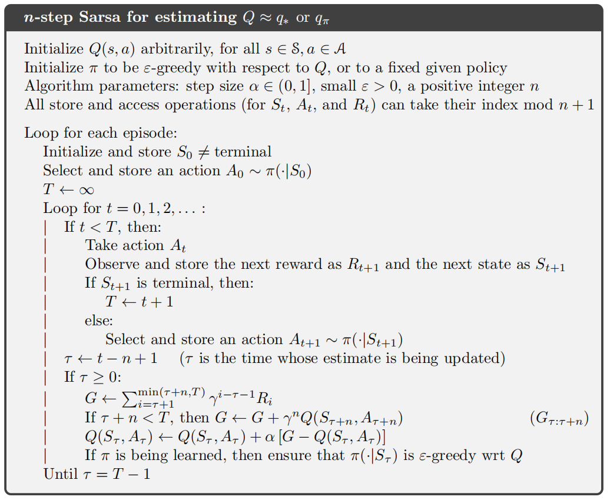

n步Sarsa相较于单步Sarsa能够加速学习，现在我们考虑这样一个例子，一个智能体在网格世界中走，除了走到G位置能获得正收益，其他走到位置的收益都是0。现在，智能体走过如下图所示一条路径

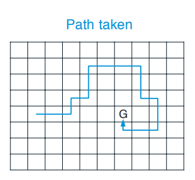

对于单步Sarsa，仅增强了这一系列动作的最后一个，使得这个动作获得了高收益

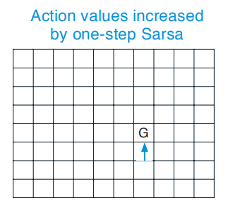

而对于n步Sarsa，这一系列动作中最后n个动作都增强了，从一个幕的序列中学到了更多的知识。也可以理解为，向G靠近的那些动作也得到了增强。

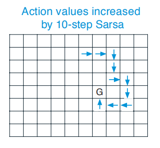

根据n步期望Sarsa回溯图，可以得到$$Q$$函数的更新规则，实际上是与n步Sarsa的形式是一样的，但是要改写n步回报
$$
G_{t: t+n} \doteq R_{t+1}+\cdots+\gamma^{n-1} R_{t+n}+\gamma^{n} \bar{V}_{t+n-1}\left(S_{t+n}\right), \quad t+n<T
$$
其中$$\bar{V}_t(s)$$是对状态$$s$$的期望价值，定义为
$$
\bar{V}_{t}(s) \doteq \sum \pi(a | s) Q_{t}(s, a), \quad \text { for all } s \in \mathcal{S}
$$
如果$$s$$是终止状态，那么它的值为$$0$$

## n步离轨策略学习

对于一个n步离轨策略学习，可以通过用重要度采样率$$\rho_{t: t+n-1}$$来加权，得到价值函数的估计$$V$$
$$
V_{t+n}\left(S_{t}\right) \doteq V_{t+n-1}\left(S_{t}\right)+\alpha \rho_{t: t+n-1}\left[G_{t: t+n}-V_{t+n-1}\left(S_{t}\right)\right], \quad 0 \leq t<T
$$
回顾重要度采样率$$\rho_{t: h}$$的定义
$$
\rho_{t: h} \doteq \prod_{k=t}^{\min (h, T-1)} \frac{\pi\left(A_{k} | S_{k}\right)}{b\left(A_{k} | S_{k}\right)}
$$
这里假如策略$$\pi$$永远不会采取某个动作，即$$\pi\left(A_{k} | S_{k}\right)=0$$，那么更新$$V$$的权重应为0，即完全忽略这个更新，这样也是合理的。另外，当$$\pi$$和$$b$$是相同的策略时$$\rho_{t: h}=1$$。

同样，n步Sarsa的更新方法也可以改为off-policy版本
$$
Q_{t+n}\left(S_{t}, A_{t}\right) \doteq Q_{t+n-1}\left(S_{t}, A_{t}\right)+\alpha \rho_{t+1: t+n}\left[G_{t: t+n}-Q_{t+n-1}\left(S_{t}, A_{t}\right)\right]
$$
注意这里的重要度采样率是$$\rho_{t+1: t+n}$$，而非$$\rho_{t: t+n-1}$$，即相比于用来进行价值函数估计$$V(s)$$，这里用来进行“状态-动作”价值函数的估计$$Q(s,a)$$时，时刻要晚一步，因为我们并不关心这些动作在此时有多大概率被选择，这个动作已经确定了。

off-policy版本的n步Sarsa算法的伪代码如下

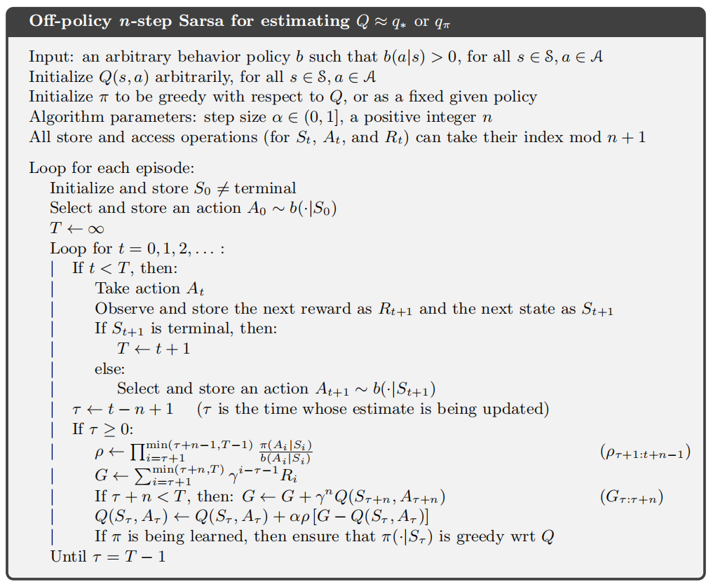

## * 带控制变量的每次决策型方法

上一节n步离轨策略方法概念上很清晰，但是不是最高效的。一种更加巧妙的方法采用了[蒙特卡罗方法](https://lnzheng.gitbook.io/notes/parti-biao-ge-xing-qiu-jie-fang-fa/meng-te-ka-luo-fang-fa)一章所提出的**每次决策型重要度采样**的思想。

考虑对于视界终点为$$h$$的$$n$$个时刻，$$n$$步回报写成递归形式为
$$
G_{t: h}=R_{t+1}+\gamma G_{t+1: h}, \quad t<h<T
$$
其中$$G_{h: h} \doteq V_{h-1}\left(S_{h}\right)$$

假设在用策略$$b$$采样后，有一个动作$$a$$是策略$$\pi$$永远不会选择的，那么就有$$\frac{\pi\left(A_{k} | S_{k}\right)}{b\left(A_{k} | S_{k}\right)}=0$$，在上一节n步离轨策略方法中把它当成目标，就会造成很大的方差。（所谓目标就是在[多臂赌博机](https://lnzheng.gitbook.io/notes/parti-biao-ge-xing-qiu-jie-fang-fa/bandits)一章中提到的形如$$NewEstimate \leftarrow OldEstimate + StepSize [ Target - OldEstimate ]$$这样的更新公式中的$$Target$$，这里的目标是$$G_{t: t+n}$$）

对于价值函数的估计，更新公式与之前讨论（n步TD）的相同
$$
V_{t+n}\left(S_{t}\right) \doteq V_{t+n-1}\left(S_{t}\right)+\alpha\left[G_{t: t+n}-V_{t+n-1}\left(S_{t}\right)\right], \quad 0 \leq t<T
$$
我可以将在视界$$h$$结束的n步回报重新定义为
$$
G_{t: h} \doteq \rho_{t}\left(R_{t+1}+\gamma G_{t+1: h}\right)+\left(1-\rho_{t}\right) V_{h-1}\left(S_{t}\right)
$$
其中
$$
\rho_{t} \doteq \frac{\pi\left(A_{t} | S_{t}\right)}{b\left(A_{t} | S_{t}\right)}
$$
当$$t$$时刻产生了这样一个动作，策略$$\pi$$永远不会选择，那么$$\rho_{t}=0$$，于是有
$$
G_{t: h} =V_{h-1}\left(S_{t}\right)\Rightarrow G_{t: t+n} =V_{t+n-1}\left(S_{t}\right)\\\\
V_{t+n}\left(S_{t}\right) = V_{t+n-1}\left(S_{t}\right)+\alpha\left[V_{t+n-1}\left(S_{t}\right)-V_{t+n-1}\left(S_{t}\right)\right]=V_{t+n-1}\left(S_{t}\right)
$$
相当于没有更新$$V_{t+n}\left(S_{t}\right)$$（这里并没有像上一节一样计算了$$n$$个时刻$$\rho_{t}$$的累乘，体现出了*每次决策*这一思想的巧妙）

注意，重新定义的n步回报的第二项$$\left(1-\rho_{t}\right) V_{h-1}\left(S_{t}\right)$$称为**控制变量**，这个控制变量并不会改变更新值的期望值，因为重要采样率$$\rho_{t}$$的期望为$$1$$，所以控制变量的期望为$$0$$。

还要注意，这个重新定义的n步回报是之前定义的on-policy版本的严格推广，on-policy版本的n步回报如下
$$
G_{t: t+n} \doteq R_{t+1}+\gamma R_{t+2}+\cdots+\gamma^{n-1} R_{t+n}+\gamma^{n} V_{t+n-1}\left(S_{t+n}\right)
$$
对于动作价值的估计，n步回报的off-policy版的定义稍有不同，因为第一个动作在重要度采样中不起作用
$$
\begin{aligned}
G_{t: h} & \doteq R_{t+1}+\gamma\left(\rho_{t+1} G_{t+1: h}+\bar{V}_{h-1}\left(S_{t+1}\right)-\rho_{t+1} Q_{h-1}\left(S_{t+1}, A_{t+1}\right)\right) \\
&=R_{t+1}+\gamma \rho_{t+1}\left(G_{t+1: h}-Q_{h-1}\left(S_{t+1}, A_{t+1}\right)\right)+\gamma \bar{V}_{h-1}\left(S_{t+1}\right), \quad t<h \leq T
\end{aligned}
$$
如果$$h<T$$，则上面的递归式结束于$$G_{h: h} \doteq Q_{h-1}\left(S_{h}, A_{h}\right)$$；如果$$h \geq T$$，则则上面的递归式结束于$$G_{h: h} \doteq R_T$$

由此定义的$$G_{t: h}$$，再结合同轨n步（期望）Sarsa的更新公式，就得到期望了期望Sarsa的扩展。

## 不需要使用重要度采样的离轨策略学习方法：n步树回溯算法

在[时序差分学习](https://lnzheng.gitbook.io/notes/parti-biao-ge-xing-qiu-jie-fang-fa/shi-xu-cha-fen-xue-xi)一章讨论了期望Sarsa算法，那有没有对应的多步算法呢，本节就要套讨论这个n步算法，成为**n步树回溯算法**

下图为一个三步树回溯图

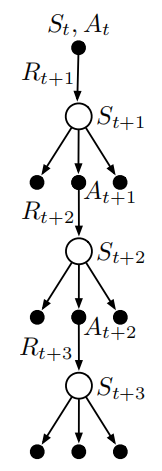

树回溯的重要思想是：从树的顶端出发，将沿途所有的收益经过适当的打折，不仅包括轨迹上确定动作$$A_{t+k}$$，还包括了每一层的分叉，更新来源于整个树。

首先，我们讨论单步树回溯的回报，事实上，它与期望Sarsa相同
$$
G_{t: t+1} \doteq R_{t+1}+\gamma \sum \pi\left(a | S_{t+1}\right) Q_{t}\left(S_{t+1}, a\right)
$$
两步树回溯的回报是
$$
\begin{aligned}
G_{t: t+2} &\doteq R_{t+1}+\gamma \sum_{a \neq A_{t+1}} \pi\left(a | S_{t+1}\right) Q_{t+1}\left(S_{t+1}, a\right) \gamma \pi\left(A_{t+1} | S_{t+1}\right)\\
& \quad\left(R_{t+2}+\gamma \sum_{a} \pi\left(a | S_{t+2}\right) Q_{t+1}\left(S_{t+2}, a\right)\right) \\
&= R_{t+1}+\gamma \sum_{a \neq A_{t+1}} \pi\left(a | S_{t+1}\right) Q_{t+1}\left(S_{t+1}, a\right)+\gamma \pi\left(A_{t+1} | S_{t+1}\right) G_{t+1: t+2}
\end{aligned}
$$
其中第二项表示对所在这一层的期望，第三项递归表示的下面一层的回报。

注意，第三项这里要乘一个权重$$\pi\left(A_{t+1} | S_{t+1}\right)$$，表示实际上是采取了动作$$A_{t+1} $$后才衍生了下一层。

对于树回溯的n步回报的递归定义的一般形式为
$$
\begin{equation}G_{t: t+n} \doteq R_{t+1}+\gamma \sum_{a \neq A_{t+1}} \pi\left(a | S_{t+1}\right) Q_{t+n-1}\left(S_{t+1}, a\right)+\gamma \pi\left(A_{t+1} | S_{t+1}\right) G_{t+1: t+n}\end{equation}
$$
特别地，$$\begin{equation}G_{T-1: t+n} \doteq R_{T}\end{equation}$$

有了这个目标就可以用于n步Sarsa的动作价值更新规则
$$
\begin{equation}Q_{t+n}\left(S_{t}, A_{t}\right) \doteq Q_{t+n-1}\left(S_{t}, A_{t}\right)+\alpha\left[G_{t: t+n}-Q_{t+n-1}\left(S_{t}, A_{t}\right)\right]\end{equation}
$$
下面给出n步树回溯的伪代码，用于估计$$q_\pi$$

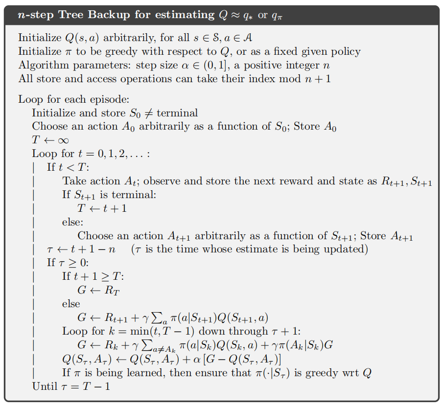

## * 一个统一的算法：n步Q($$\sigma$$)

一种统一n步Sarsa、n步期望Sarsa和n步树回溯的思想是：对逐个状态决定是否采取采样操作，即选取一个动作作为样本（Sarsa算法的情况），好哦这考虑所有可能动作的期望（树回溯算法的情况）。

设置一个变量$$\sigma$$，用来表示是否采样，$$\sigma=1$$表示进行采样，$$\sigma=0$$表示不进行采样

n步Sarsa、n步期望Sarsa、n步树回溯和n步Q($$\sigma$$)的回溯图如下图所示

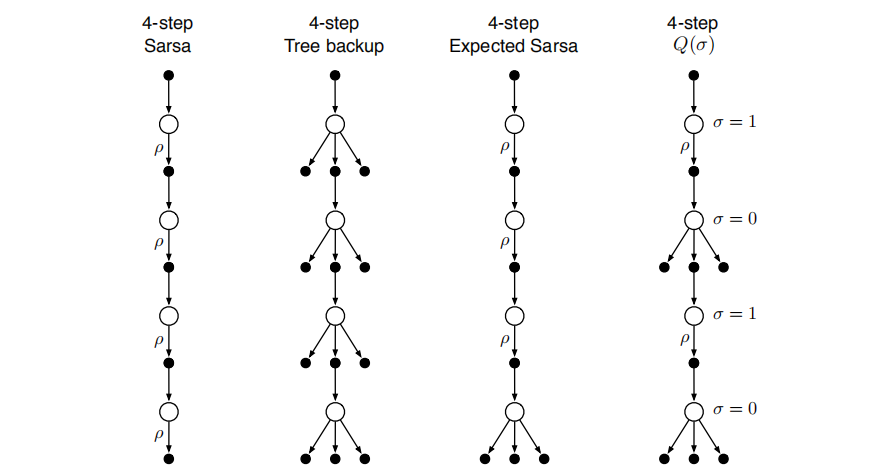

现在推导n步Q($$\sigma$$)的公式。首先需诶出视界$$h=t+n$$时的树回溯算法的n步回报
$$
\begin{equation}\begin{aligned}
G_{t: h} &=R_{t+1}+\gamma \sum_{a \neq A_{t+1}} \pi\left(a | S_{t+1}\right) Q_{h-1}\left(S_{t+1}, a\right)+\gamma \pi\left(A_{t+1} | S_{t+1}\right) G_{t+1: h} \\
&=R_{t+1}+\gamma \bar{V}_{h-1}\left(S_{t+1}\right)-\gamma \pi\left(A_{t+1} | S_{t+1}\right) Q_{h-1}\left(S_{t+1}, A_{t+1}\right)+\gamma \pi\left(A_{t+1} | S_{t+1}\right) G_{t+1: h} \\
&=R_{t+1}+\gamma \pi\left(A_{t+1} | S_{t+1}\right)\left(G_{t+1: h}-Q_{h-1}\left(S_{t+1}, A_{t+1}\right)\right)+\gamma \bar{V}_{h-1}\left(S_{t+1}\right)
\end{aligned}\end{equation}
$$
然后将上式的“步长”$$\pi\left(A_{t+1} | S_{t+1}\right)$$替换为$$\left(\sigma_{t+1} \rho_{t+1}+\left(1-\sigma_{t+1}\right) \pi\left(A_{t+1} | S_{t+1}\right)\right)$$得到
$$
\begin{aligned}
G_{t: h} \doteq R_{t+1} &+\gamma\left(\sigma_{t+1} \rho_{t+1}+\left(1-\sigma_{t+1}\right) \pi\left(A_{t+1} | S_{t+1}\right)\right)\left(G_{t+1: h}-Q_{h-1}\left(S_{t+1}, A_{t+1}\right)\right) \\
&+\gamma \bar{V}_{h-1}\left(S_{t+1}\right)
\end{aligned}
$$
上面递归公式的终止条件为$$G_{h: h} \doteq Q_{h-1}\left(S_{h}, A_{h}\right) \text { if } h<T$$，或者$$G_{T-1: T} \doteq R_{T} \text { if } h=T$$

这个式子很像带控制变量的n步Sarsa的回报。

下面给出off-policy版本的n步Q($$\sigma$$)算法的伪代码

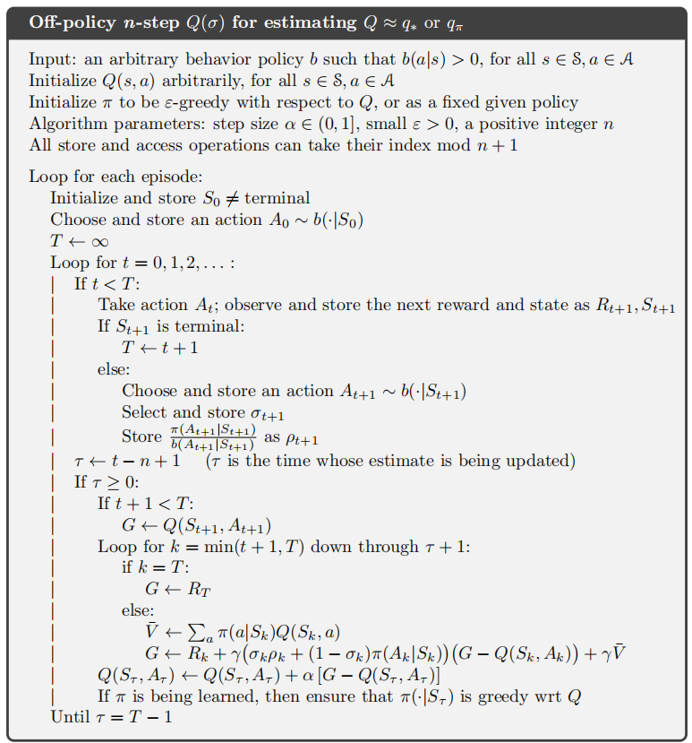

