# 基于表格型方法的规划和学习

前面的章节介绍了基于模型的方法和无模型的方法，本章的目标是**将基于模型的方法和无模型的方法整合起来**。

- 基于模型的方法：需要环境模型，将规划作为主要部分，往往能够充分利用经验，但实现相对复杂，模型可能有偏差，如动态规划(DP)和启发式搜索
- 无模型的方法：不需要环境模型，主要依赖学习，往往经验的利用率低，但实现较为简单，如MC方法和TD方法

在本章中，提出一个统一的视角，所有的状态空间规划算法都有一个通用的结构，我们所讨论的所有的学习方法都体现了这个结构

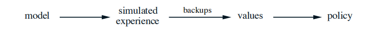

这里有两个基本的思想：

1. 所有的状态空间规划算法都会利用到价值函数作为改善策略的关键中间步骤；
2. 他们通过基于仿真经验的回溯操作来计算价值函数（例如之前讨论的回溯图）

**注：**对于本章，书中有很多例子，方便加深理解。

## Dyna：集成了规划、行动和学习

智能体与环境交互会得到新的经验，这些经验可以扮演两个角色：

- 用来改进模型，使模型跟接近真实环境，这种学习方式称为**模型学习**
- 用来改善价值函数和策略，这种学习方式称为**直接强化学习**（direct RL）

下图展示了经验，模型，价值/策略三者是如何相互影响的

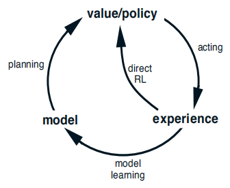

**注：**模型学习和直接强化学习分别对应了心理学和人工智能领域的“原理认知”和“试错学习”，或者“主动的预谋性规划”和“被动的反应式决策”

Dyna-Q包括了上图所示的所有过程，包括规划，动作，模型学习和直接强化学习，下图给出了Dyna的总体架构。

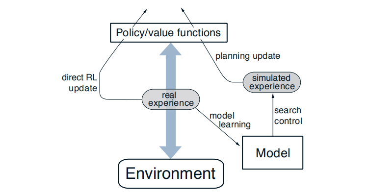

**注：**搜索控制（search control）这个术语用于表示模型生成的模拟经验选择初始状态和动作的行为

图左半边表示直接强化学习操作，图右半边表示模型学习操作。从概念上讲这两部分是并行的，但是要用计算中串行实现，下面给出Dyna-Q的伪代码

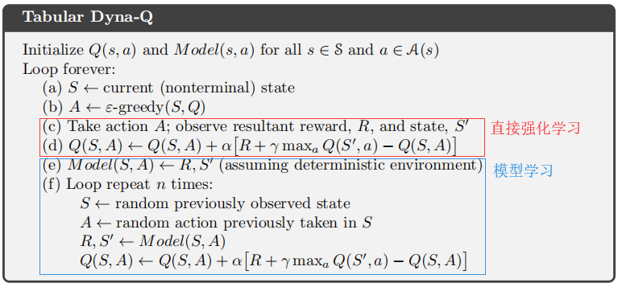

## 当模型错误的时候

现在我们考虑这样一个问题，当环境发生变化时，由于采集到的样本有限，或者模型使用泛化能力差的函数来近似，或者环境变化后新的动态没有观察到，都会使得模型不正确。

我们对Dyna-Q算法做一点改进，增加额外的试探收益来鼓励试探性动作，称为Dyna-Q+。

考虑下面的情况，当1000步时，迷宫的屏障发生变化，原来的最短路径被封锁，此时Dyna-Q和Dyna-Q+的累积回报曲线变平，经过一段时间后都可以找到新的路径

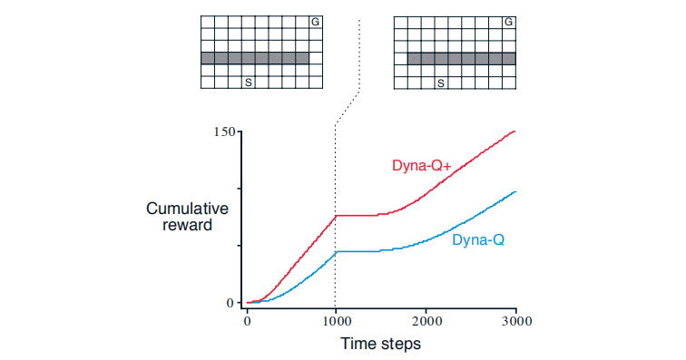

考虑下面的情况，当3000步时，迷宫的屏障发生变化，打开了一个新的最短短路径，一段时间后，Dyna-Q+能够找到这条捷径，而Dyna-Q并不能意识到这条捷径的存在

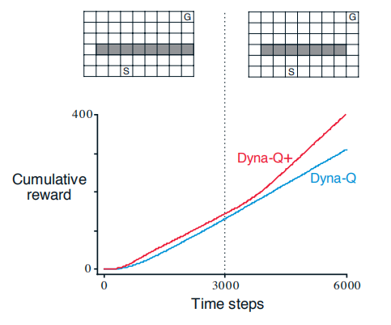

在“规划”的语境中，“试探”意味着那些改善模型的动作，“开发”则意味着以当前模型的最优方式来执行动作。为了鼓励测试长期未出现的动作，可以设置“额外收益”，收益设为$$r+\kappa \sqrt{\tau}$$，其中$$\kappa$$是一个很小的数，$$\tau$$表示这个动作在多长时间内没有被尝试。当然，这些试探动作都有代价，但是这种“计算上的”好奇心是非常值得付出额外代价的。

## 优先遍历

在上面的例子中，只有到达终点的“状态-动作”二元组才具有价值，而其他二元组的价值是0，在更新时，对于大多是价值函数的更新是没有意义的，只有那些跳入终点之前的状态或者从这个状态跳出去的转移过程才会导致价值估计的改变。一般来说，我们希望从目标状态开始更新，然后更新相关前导状态的价值，以此类推，这个总体思路称为**反向聚焦**。在更新时，一些更新的变化可能很大，一些更新的变化可能并不大，我们优先更新那些造成价值变化大的状态的价值，再更新其可能的前导状态的价值，使用优先队列维护。

下面给出在确定性环境下的优先级遍历算法的伪代码

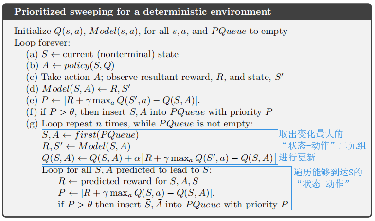

下图说明了对于迷宫问题，优先遍历相比于Dyna-Q具有明显优势（能够在更少的更新数内得到最优解）

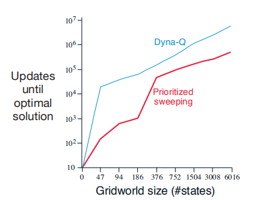

## 期望更新与采样更新的对比

之前讨论的大部分算法都是关于不同类型的价值函数更新的，我们先关注单步更新方法，他们主要沿着三个维度产生变化：

1. 更新的是$$v$$函数还是$$q$$函数
2. 他们所估计的价值对应的是最优策略还是任意给定策略

基于前两个维度，组合出4种更新，用于更新4个价值函数$$q_{*}, v_{*}, q_{\pi}, v_{\pi}$$

3. 采用期望更新还是采样更新

这三个维度产生了8种情况，其中7种对于应特定的算法

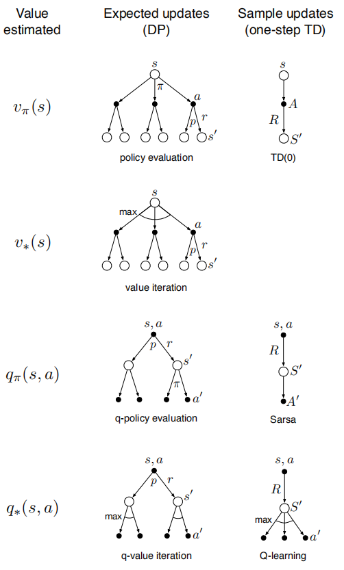

通过一个具体例子来比较期望更新和采样更新：

q-价值迭代的期望更新是
$$
Q(s, a) \leftarrow \sum_{s^{\prime}, r} \hat{p}\left(s^{\prime}, r | s, a\right)\left[r+\gamma \max _{a^{\prime}} Q\left(s^{\prime}, a^{\prime}\right)\right]
$$
q学习的采样更新是
$$
Q(s, a) \leftarrow Q(s, a)+\alpha\left[R+\gamma \max _{a^{\prime}} Q\left(S^{\prime}, a^{\prime}\right)-Q(s, a)\right]
$$
当环境是随机环境时，后继状态有多种可能，并且概率各不相同。如果只有一个后继状态，那么上面的期望更新和采样更新是相同的（取$$\alpha=1$$），如果有多个后继状态，那他们就有显著的区别

期望更新的优势是它是一个精确的计算，采样更新的优势是它的计算复杂度低，设$$b$$是分支因子，指可能的后继状态数目，则这个二元组的期望更新需要的计算量大约是采样更新的$$b$$倍。

下图展示了多个不同的分支因子$$b$$下，期望更新和采样更新的估计误差对计算次数函数变化（这里假定所有$$b$$个后继节点都是等概率发生的，初始误差都是1，并且采样平均值，即$$\alpha=1/t$$）

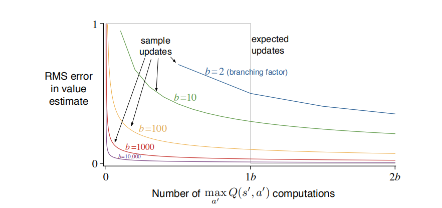

可以看出若能保证在$$b$$次计算，期望更新一定会比采样更新表现更好。但是如果$$b$$是一个很大的数，那么难以做到$$b$$次计算，于是采样更新的表现就更好，在这种情况下，采样更新会使得误差以比例系数$$\sqrt{\frac{b-1}{b t}}$$减小。

## 轨迹采样

本节我们比较两种distributing updates（价值更新的分配）的方式——**均匀分布**和**同轨策略**

均匀分布的方法是遍历整个状态（或"状态-动作"）空间，每遍历一次就进行一次更新，将算力均匀地用于状态空间的所有部分，而不是集中在需要的地方。

共轨策略的方法是按照当前策略所给出的分布来决定，也就是说，我们只要按部就班就与模型交互并遵循当前策略就可以了，这样我们就可以得到一条完整轨迹，再对沿途进行回溯更新，这种借助模拟生成经验来进行回溯更新的方法称为**轨迹采样**。

在均匀分布的情况下，我们需要遍历所有的“状态-动作”二元组；在同轨策略的情况下，我们模拟多幕数据，进行回溯更新。

下图展示了不同人物中均匀分布和同轨策略的相对效率

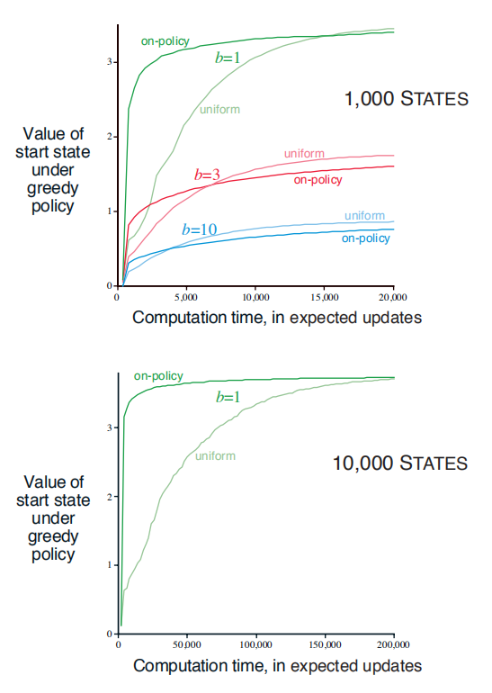

同轨策略显示出这样的趋势：初期规划速度快，长期变化迟缓，且分支越小这个效应越强，状态数越多，这个效应越强。在这种情况下，同轨策略的优势很大，并且可以保持很长时间。

但是同轨策略也有劣势，通常采样到的状态已经有了正确的估值，采样到它们并没有用，只有采样到其他价值才有意义。对于小规模问题，采用穷举式、分散式的采样方式更加适合。

## 实时动态规划

实时动态规划（RTDP）是动态规划价值迭代算法的同轨策略采样版本（上节所讨论的同轨策略）。

传统的价值迭代的方法更新所有状态的价值，而RTDP则关注与问题相关的状态子集

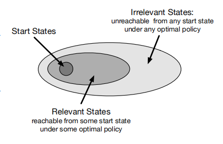

RTDP只需传统遍历价值迭代发所需计算量的50%就实现了几乎所有最优的控制。

## 决策时规划

"规划"至少有两种运行方式。

1. **后台规划**：在当前状态，改善多个表格条目（表格型方法）或数学表达式（近似方法）
2. **决策时规划**：使用模拟经验为当前状态选择一个动作

决策时规划在不需要快速响应的应用程序中是最有用的。

## 启发式搜索

略

## 预演算法

预演（rollout）算法是一种基于蒙特卡罗控制的决策时规划算法，预演算法通过平均多次可能的动作并遵循给定的预演策略的来估计动作的价值，当动作价值的估计被认为足够准确时，对应最高估计值的动作会被执行。（例如在下棋时，智能体在行动之前预演许多遍才能决定哪个动作会被执行）

一般不认为预演算法是一种学习算法，因为他们不会保持对于价值或策略的长期记忆。

## 蒙特卡罗树搜索

蒙特卡罗树搜索（MCTS）是一种预演算法，通过模拟多次从当前状态开始到终止状态的轨迹，对动作进行估值，一般实现中会保存选中的动作价值，在下一次的执行中很可能会有用，一般预演策略/树策略可以使用$$\epsilon-$$贪心或UCB选择规则（见[多臂赌博机](https://lnzheng.gitbook.io/notes/parti-biao-ge-xing-qiu-jie-fang-fa/bandits)）

具体来说，一个基本的MCTS的每次循环包括下面4个步骤：

	1. **选择**
 	2. **扩展**
 	3. **模拟**
 	4. **回溯**

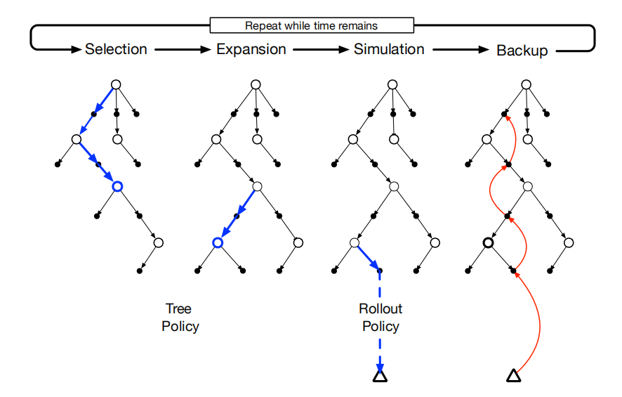

