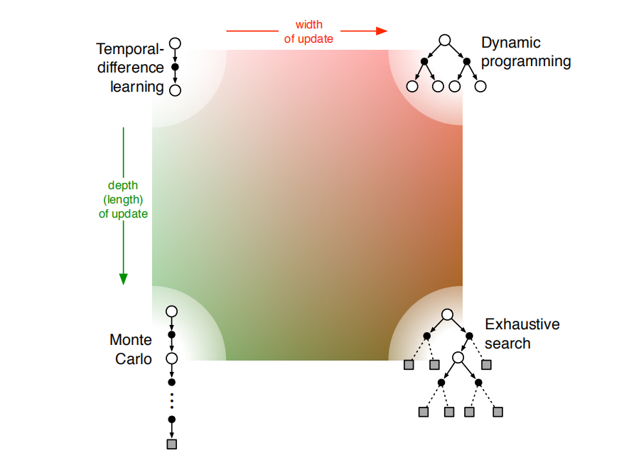

# 第一部分总结

我们就用方法空间中不同维度对应的概念对前面介绍过各种算法进行总结。前面提到的所有方法都包含三个重要的通用思想，这三个也是贯穿整本书的核心内容：

1. 都需要估计价值函数
2. 都需要沿着真实或模拟的状态轨迹进行回溯操作来更新价值估计
3. 都遵循广义策略迭代（GPI）的通用流程

不同方法变种最重要的两个维度分别是

1. 更新的宽度，使用采样更新（基于采样序列）还是期望更新（基于序列的分布）
2. 更新的深度，或者说“自举”的程度

下图中基于这两个重要的维度举出了4类算法，有3个是用于估计价值的重要方法：动态规划（DP）、时序差分（TD）和蒙特卡罗（MC）

第三个重要的维度是同轨策略和离轨策略的维度，行动策略和目标策略是否是同一策略

当然，还有其他分类标准，以供参考

- 回报的定义
- 分幕式还是持续性
- 带折扣还是不折扣
- 动作选择/试探
- 同步还是异步（对于状态更新）
- 真实还是模拟仿真
- 更新的位置（无模型的方法只能从真实的状态或“状态-动作”二元组中选择，而基于模型的方法可以任意选择）
- 更新的时机（更新时动作选择的一部分，还是在动作选择之后）
- 更新的记忆（更新的价值应该被保存多久）

最重要的一个维度在第一部分没有涉及，将在第二部分展开讨论，这个维度就函数逼近。