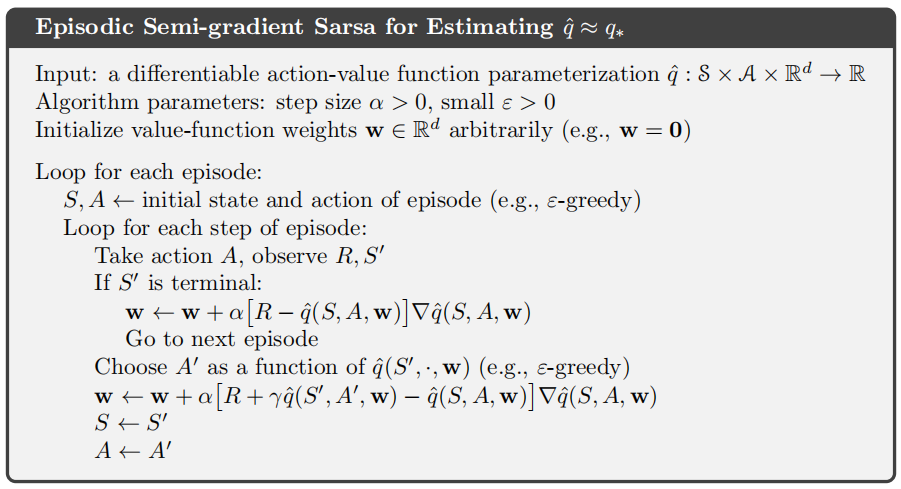
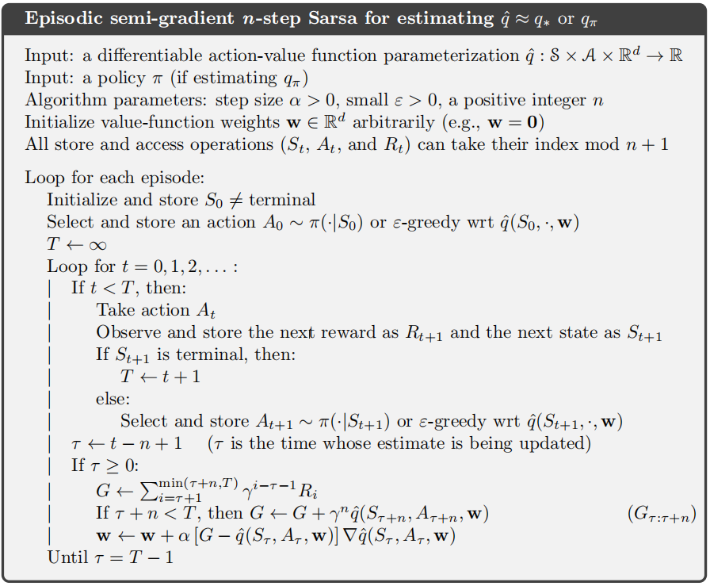
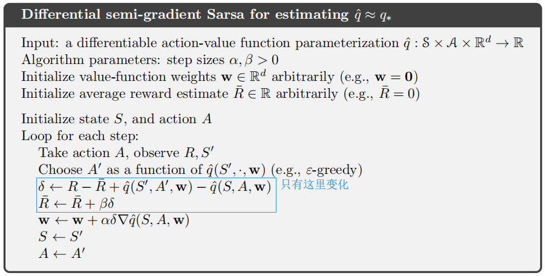
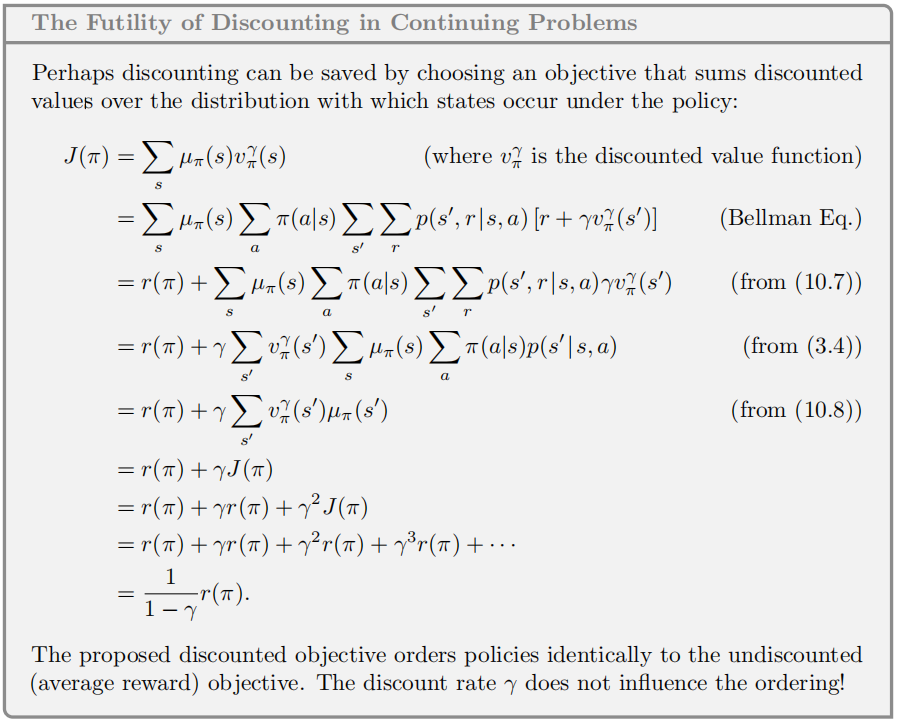
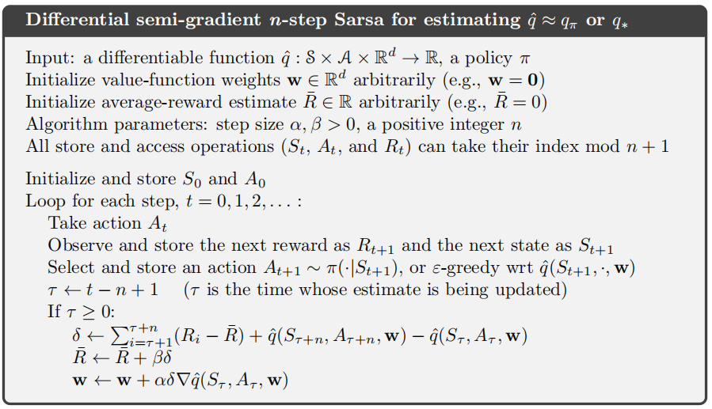

# 基于函数逼近的同轨策略控制

## 分幕式半梯度控制

之前我们关注更新形式是$$S_t \mapsto U_t$$，现在我们要$$S_t,A_t \mapsto U_t$$这样的更新，更新目标$$U_t$$可以是$$q_\pi(S_t,A_t)$$的任意近似，比如MC回报会n步Sarsa回报。

更新的一般形式为
$$
\mathbf{w}_{t+1} \doteq \mathbf{w}_{t}+\alpha\left[U_{t}-\hat{q}\left(S_{t}, A_{t}, \mathbf{w}_{t}\right)\right] \nabla \hat{q}\left(S_{t}, A_{t}, \mathbf{w}_{t}\right)
$$
可以看作对目标函数函数$$J(\mathbf{w})=\frac{1}{2}\left[U_{t}-\hat{q}\left(S_{t}, A_{t}, \mathbf{w}\right)\right]^2$$做梯度下降

单步Sarsa的更新可表示为
$$
\mathbf{w}_{t+1} \doteq \mathbf{w}_{t}+\alpha\left[R_{t+1}+\gamma \hat{q}\left(S_{t+1}, A_{t+1}, \mathbf{w}_{t}\right)-\hat{q}\left(S_{t}, A_{t}, \mathbf{w}_{t}\right)\right] \nabla \hat{q}\left(S_{t}, A_{t}, \mathbf{w}_{t}\right)
$$
如果动作集合是离散的且不是很大，那么我们可以结合动作价值函数预测、策略改进以及动作选择技术结合起来，得到分幕式半梯度Sarsa的伪代码

## 半梯度n步Sarsa

我们使用n步回报作为半梯度Sarsa的更新目标，可以容易地从表格型推广到函数逼近形式

通常，如果$$ \text { if } t+n \geq T$$则有$$G_{t: t+n} \doteq G_{t}$$，n步的更新公式为
$$
\mathbf{w}_{t+n} \doteq \mathbf{w}_{t+n-1}+\alpha\left[G_{t: t+n}-\hat{q}\left(S_{t}, A_{t}, \mathbf{w}_{t+n-1}\right)\right] \nabla \hat{q}\left(S_{t}, A_{t}, \mathbf{w}_{t+n-1}\right), \quad 0 \leq t<T
$$
完整的伪代码如下

# 平均收益：持续性任务中的新的问题设定

在平均收益设定中，一个策略$$\pi$$的质量被定义为“在遵循该策略时的收益率平均值”，成为平均收益
$$
\begin{aligned}
r(\pi) & \doteq \lim _{h \rightarrow \infty} \frac{1}{h} \sum_{t=1}^{h} \mathbb{E}\left[R_{t} | S_{0}, A_{0: t-1} \sim \pi\right] \\
&=\lim _{t \rightarrow \infty} \mathbb{E}\left[R_{t} | S_{0}, A_{0: t-1} \sim \pi\right] \\
&=\sum_{s} \mu_{\pi}(s) \sum_{a} \pi(a | s) \sum_{s^{\prime}, r} p\left(s^{\prime}, r | s, a\right) r
\end{aligned}
$$
这里的期望根据初始状态$$S_{0}$$和动作序列$$A_{0: t-1}$$决定，$$\mu_{\pi}(s)$$是一个稳态分布，表示当动作序列$$A_{0: t-1}$$遵循策略$$\pi$$时，状态$$s$$为稳态的概率
$$
\mu_{\pi}(s) \doteq \lim _{t \rightarrow \infty} \operatorname{Pr}\left\{S_{t}=s | A_{0: t-1} \sim \pi\right\}
$$
在平均收益设定中，回报是根据即使收益和平均收益的差定义的
$$
G_{t} \doteq R_{t+1}-r(\pi)+R_{t+2}-r(\pi)+R_{t+3}-r(\pi)+\cdots
$$
这称为**差分回报**，相应的价值函数称为差分**价值函数**（用即时收益和平均收益的差代替怀来的即时收益，并且不需要折扣$$\gamma$$）
$$
\begin{aligned}
&v_{\pi}(s)=\sum_{a} \pi(a | s) \sum_{r, s^{\prime}} p\left(s^{\prime}, r | s, a\right)\left[r-r(\pi)+v_{\pi}\left(s^{\prime}\right)\right]\\
&q_{\pi}(s, a)=\sum_{r, s^{\prime}} p\left(s^{\prime}, r | s, a\right)\left[r-r(\pi)+\sum_{a^{\prime}} \pi\left(a^{\prime} | s^{\prime}\right) q_{\pi}\left(s^{\prime}, a^{\prime}\right)\right]\\
&v_{*}(s)=\max _{a} \sum_{r, s^{\prime}} p\left(s^{\prime}, r | s, a\right)\left[r-\max _{\pi} r(\pi)+v_{*}\left(s^{\prime}\right)\right], \text { and }\\
&q_{*}(s, a)=\sum p\left(s^{\prime}, r | s, a\right)\left[r-\max _{\pi} r(\pi)+\max _{a^{\prime}} q_{*}\left(s^{\prime}, a^{\prime}\right)\right]
\end{aligned}
$$
同样地，两类TD误差也有差分形式
$$
\delta_{t} \doteq R_{t+1}-\bar{R}_{t}+\hat{v}\left(S_{t+1}, \mathbf{w}_{t}\right)-\hat{v}\left(S_{t}, \mathbf{w}_{t}\right)\\

\delta_{t} \doteq R_{t+1}-\bar{R}_{t}+\hat{q}\left(S_{t+1}, A_{t+1}, \mathbf{w}_{t}\right)-\hat{q}\left(S_{t}, A_{t}, \mathbf{w}_{t}\right)
$$
$$\bar{R}_{t}$$是在$$t$$时刻对平均收益$$r(\pi)$$的估计

差分半梯度Sarsa算法，用于估计$$q_*$$的伪代码如下

 ## 弃用折扣

在一个没有开始或结束的无限长的收益序列，有两种考察策略$$\pi$$的性能，一种方法是计算较长时间间隔的平均收益，即平均收益的设定；一种方法是使用折后回报，事实上，折后回报的均值总是$$r(\pi)/(1-\gamma)$$，本质上就是平均收益$$r(\pi)$$。

下面证明了在这后回报的设定下，折后回报的均值总是$$r(\pi)/(1-\gamma)$$

这个证明表明，我们优化一个**折后价值函数**，和优化一个**无折扣的平均收益**的效果完全相同

## 差分半梯度n步Sarsa

将n步回报推广到它的差分形式
$$
G_{t: t+n} \doteq R_{t+1}-\bar{R}_{t+n-1}+\cdots+R_{t+n}-\bar{R}_{t+n-1}+\hat{q}\left(S_{t+n}, A_{t+n}, \mathbf{w}_{t+n-1}\right)
$$
n步TD误差定义为
$$
\delta_{t} \doteq G_{t: t+n}-\hat{q}\left(S_{t}, A_{t}, \mathbf{w}\right)
$$
如果$$t+n\geq T$$，则有$$G_{t: t+n} \doteq G_{t}$$

下面给出了差分半梯度Sarsa算法的伪代码

