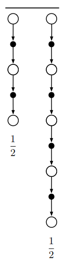
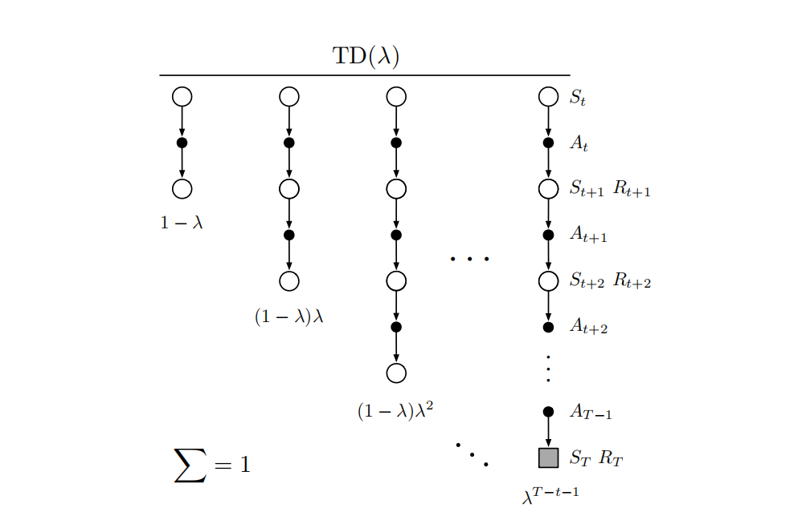
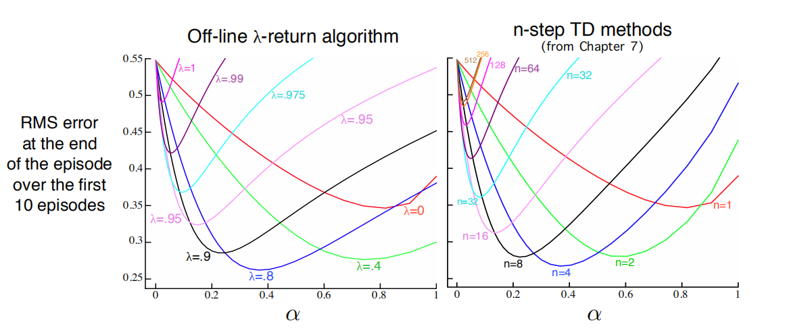
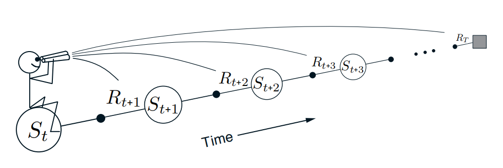
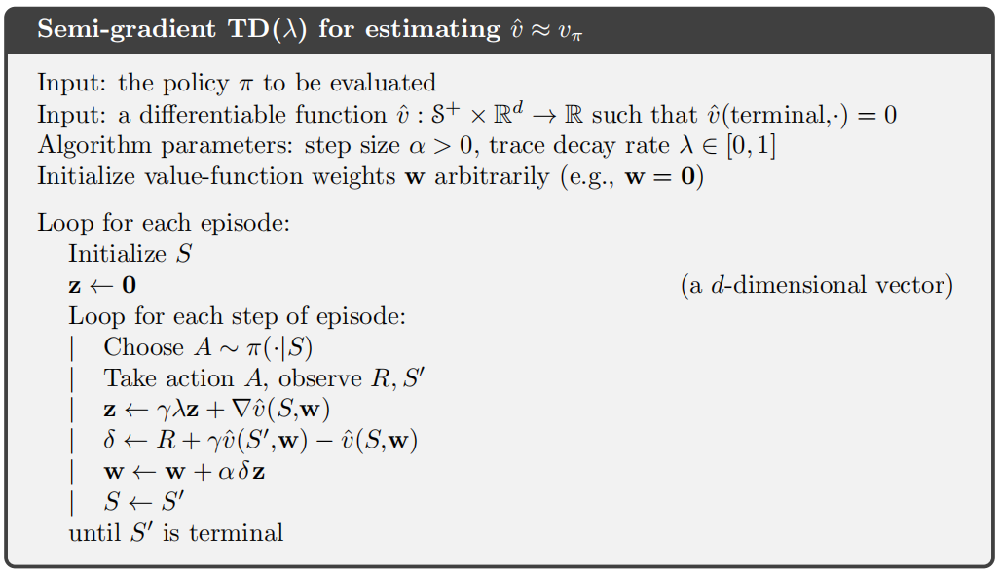
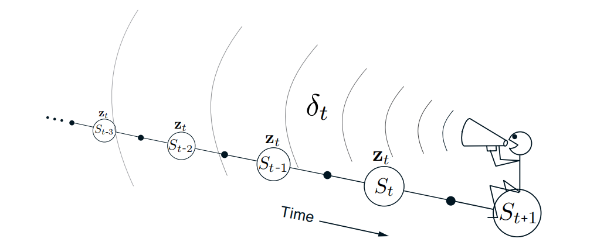
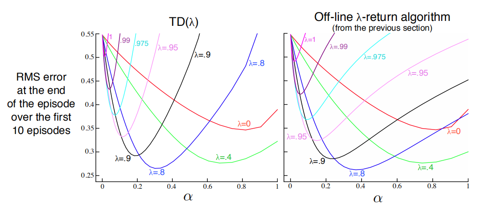
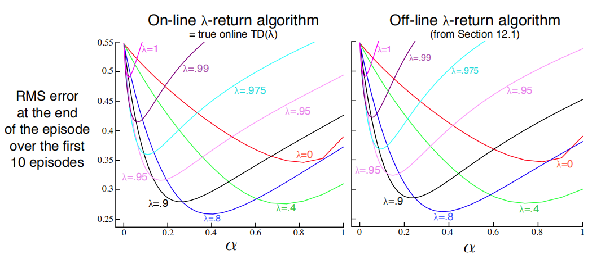

# 资格迹

## $$\lambda-$$回报

之前我们定义了n步会报的一般形式为
$$
G_{t: t+n} \doteq R_{t+1}+\gamma R_{t+2}+\cdots+\gamma^{n-1} R_{t+n}+\gamma^{n} \hat{v}\left(S_{t+n}, \mathbf{w}_{t+n-1}\right), \quad 0 \leq t \leq T-n
$$
我们可以使用不同的n的平均n步回报作为更新目标，这种方式称为复合更新。例如，我们以2步回报和4步回报的平均值作为更新目标，及$$\frac{1}{2} G_{t: t+2}+\frac{1}{2} G_{t: t+4}$$，这个复合更新的回溯图由两部分单独的回溯图组成，每一部分下面注明权重

更一般地，可以用$$\lambda^{n-1}$$作为相应n步回报的权重，再加上正则项$$(\lambda-1)$$保证权值和为$$1$$，产生的结果称为$$\lambda$$回报
$$
G_{t}^{\lambda} \doteq(1-\lambda) \sum_{n=1}^{\infty} \lambda^{n-1} G_{t: t+n}
$$
到达终止状态过后（$$t\geq T$$），后续所有的n步回报都等于$$G_t$$，上式也可改写为
$$
G_{t}^{\lambda}=(1-\lambda) \sum_{n=1}^{T-t-1} \lambda^{n-1} G_{t: t+n}+\lambda^{T-t-1} G_{t}
$$
下图展示了TD回报的每个n步更新的回溯图

当$$\lambda=1$$时，即MC更新；当$$\lambda=0$$时，即单步回报

我们可以基于$$\lambda-$$回报定义定义一个学习算法，即离线$$\lambda-$$回报算法。更新发生在幕结束后，而不是在幕序列中间，所以被称为离线算法
$$
\mathbf{w}_{t+1} \doteq \mathbf{w}_{t}+\alpha\left[G_{t}^{\lambda}-\hat{v}\left(S_{t}, \mathbf{w}_{t}\right)\right] \nabla \hat{v}\left(S_{t}, \mathbf{w}_{t}\right), \quad t=0, \ldots, T-1
$$
离线$$\lambda-$$回报算法和n步时序差分都是在单步TD和MC之间平滑移动的算法，下图展示了两种算法对于不同参数的性能，两种算法都是在参数取中间值时获得最好性能，而且两种算法性能相当

我们目前采取的所有算法，理论上都是**前向的**，即每次更新完一个状态，移到下一个状态后再也不会往回更新之前的状态，并且未来状态会从之前的位置被重复地观测与处理

## $$\text TD(\lambda)$$

$$\text TD(\lambda)$$通过三种方式改进了离线$$\lambda-$$回报算法

- 在每一步更新权重，而不是在幕结束后更新
- 将计算平均分配在整个时间轴上
- 既适用于分幕式任务，也适用于持续性任务

资格迹$$\mathbf{z}_{t} \in \mathbb{R}^{d}$$是一个权值向量$$\mathbf{w}_{t}$$同维度的向量。权值向量负责长期记忆，资格迹负责短期记忆。$$\text TD(\lambda)$$中，资格迹向量被初始化为零，然后在每一步加上价值函数的梯度，并以$$\gamma\lambda$$衰减
$$
\begin{aligned}
&\mathbf{z}_{-1} \doteq \mathbf{0}\\
&\mathbf{z}_{t} \doteq \gamma \lambda \mathbf{z}_{t-1}+\nabla \hat{v}\left(S_{t}, \mathbf{w}_{t}\right), \quad 0 \leq t \leq T
\end{aligned}
$$
预测的状态价值函数的时序差分误差为
$$
\delta_{t} \doteq R_{t+1}+\gamma \hat{v}\left(S_{t+1}, \mathbf{w}_{t}\right)-\hat{v}\left(S_{t}, \mathbf{w}_{t}\right)
$$
权值向量的每一步更新正比于时序差分误差和资格迹
$$
\mathbf{w}_{t+1} \doteq \mathbf{w}_{t}+\alpha \delta_{t} \mathbf{z}_{t}
$$
资格迹相当于一个短期记忆，展示了权值向量有多少“资格”可以接受学习过程引起的变化

完整的半梯度$$\text TD(\lambda)$$算法的伪代码如下

$$\text TD(\lambda)$$在时间轴上向回看。每个时刻都要计算当前时刻的TD误差，并根据之前状态对当前资格迹的贡献来分配它

在一个状态流中，计算TD误差，然后将其传播给之前访问的状态。更新时，TD误差和资格迹同时起作用。

特别地，当$$\lambda=0$$时，资格迹$$\mathbf{z}_{t} \doteq \nabla \hat{v}\left(S_{t}, \mathbf{w}_{t}\right)$$，退化为半梯度时序差分更新，因此成为TD(0)算法。当$$\lambda=1$$时，那么之前状态的“信用”每步仅仅衰减$$\gamma$$，恰好与蒙特卡罗算法的行为一致，如果$$\lambda=1，\gamma=1$$，那么资格迹在任何时候都不衰减，与无折扣的分幕式任务的蒙特卡罗算法的行为一致。当$$\lambda=1$$时，也被称为$$\text TD(1)$$

$$\lambda$$越大，意味着更多的之前的状态会被改变，但是越远的状态改变越小（如图所示），因为对应的资格迹更小。也可以说，较远的状态对于TD误差的“信用”较低。

下图对比了$$\text TD(\lambda)$$和离线$$\lambda-$$回报算法在19状态随机游走问题上的表现，当步长$$\alpha$$为最优步长时，两种算法效果相当，当步长大于最优步长时$$\text TD(\lambda)$$效果变差更多甚至不稳定

如果步长随时间推移而减小，那么算法可以证明在同轨策略下收敛，收敛到的误差不会超过最小误差的$$\frac{1-\gamma \lambda}{1-\gamma}$$倍，即
$$
\overline{\mathrm{VE}}\left(\mathbf{w}_{\infty}\right) \leq \frac{1-\gamma \lambda}{1-\gamma} \min _{\mathbf{w}} \overline{\mathrm{VE}}(\mathbf{w})
$$

## n步截断$$\lambda-$$回报算法

离线$$\lambda-$$回报是一种理想情况，我们可以某个视界$$h$$，则当前时刻$$t$$的**截断$$\lambda-$$回报**为
$$
G_{t: h}^{\lambda} \doteq(1-\lambda) \sum_{n=1}^{h-t-1} \lambda^{n-1} G_{t: t+n}+\lambda^{h-t-1} G_{t: h}, \quad 0 \leq t<h \leq T
$$
在使用价值函数的情况下，这类算法成为截断$$\text TD(\lambda)$$，或$$\text {TTD}(\lambda)$$
$$
\mathbf{w}_{t+n} \doteq \mathbf{w}_{t+n-1}+\alpha\left[G_{t: t+n}^{\lambda}-\hat{v}\left(S_{t}, \mathbf{w}_{t+n-1}\right)\right] \nabla \hat{v}\left(S_{t}, \mathbf{w}_{t+n-1}\right), \quad 0 \leq t<T
$$
另外一种更高效地实现，依赖于k步$$\lambda-$$回报可以写为
$$
G_{t: t+k}^{\lambda}=\hat{v}\left(S_{t}, \mathbf{w}_{t-1}\right)+\sum_{i=t}^{t+k-1}(\gamma \lambda)^{i-t} \delta_{i}^{\prime}
$$
其中
$$
\delta_{t}^{\prime} \doteq R_{t+1}+\gamma \hat{v}\left(S_{t+1}, \mathbf{w}_{t}\right)-\hat{v}\left(S_{t}, \mathbf{w}_{t-1}\right)
$$

## 重做更新：在线$$\lambda-$$回报算法

截断$$\lambda-$$回报中的的截断参数$$n$$需要折中考虑：$$n$$越大，算法越接近$$\lambda-$$回报算法；$$n$$越大，算法更新越快并且能更迅速地影响后续行为。

折中的基本思想是，在每一步收集到更新后，回到当前幕的开始重做所有更新，由于获得了新的数据，因此新的更新会比原来的更好，也需要使用新的视界。

例如，更新过程可以表示为
$$
\begin{aligned}
h=1: & \mathbf{w}_{1}^{1} \doteq \mathbf{w}_{0}^{1}+\alpha\left[G_{0: 1}^{\lambda}-\hat{v}\left(S_{0}, \mathbf{w}_{0}^{1}\right)\right] \nabla \hat{v}\left(S_{0}, \mathbf{w}_{0}^{1}\right) \\
h=2: & \mathbf{w}_{1}^{2} \doteq \mathbf{w}_{0}^{2}+\alpha\left[G_{0: 2}^{\lambda}-\hat{v}\left(S_{0}, \mathbf{w}_{0}^{2}\right)\right] \nabla \hat{v}\left(S_{0}, \mathbf{w}_{0}^{2}\right) \\
& \mathbf{w}_{2}^{2} \doteq \mathbf{w}_{1}^{2}+\alpha\left[G_{1: 2}^{\lambda}-\hat{v}\left(S_{1}, \mathbf{w}_{1}^{2}\right)\right] \nabla \hat{v}\left(S_{1}, \mathbf{w}_{1}^{2}\right) \\
h=3: & \mathbf{w}_{1}^{3} \doteq \mathbf{w}_{0}^{3}+\alpha\left[G_{0: 3}^{\lambda}-\hat{v}\left(S_{0}, \mathbf{w}_{0}^{3}\right)\right] \nabla \hat{v}\left(S_{0}, \mathbf{w}_{0}^{3}\right) \\
& \mathbf{w}_{2}^{3} \doteq \mathbf{w}_{1}^{3}+\alpha\left[G_{1: 3}^{2}-\hat{v}\left(S_{1}, \mathbf{w}_{1}^{3}\right)\right] \nabla \hat{v}\left(S_{1}, \mathbf{w}_{1}^{3}\right) \\
& \mathbf{w}_{3}^{3} \doteq \mathbf{w}_{2}^{3}+\alpha\left[G_{2: 3}^{\lambda}-\hat{v}\left(S_{2}, \mathbf{w}_{2}^{3}\right)\right] \nabla \hat{v}\left(S_{2}, \mathbf{w}_{2}^{3}\right)
\end{aligned}
$$
其中，$$\mathbf{w}_t^h$$表示在视界为$$h$$的序列的时刻$$t$$所生成的权值。最后一个视界$$h=T$$获得的权值$$\mathbf{w}_T^T$$会被传给下一幕用作初始权值向量

更新的一般形式为
$$
\mathbf{w}_{t+1}^{h} \doteq \mathbf{w}_{t}^{h}+\alpha\left[G_{t: h}^{\lambda}-\hat{v}\left(S_{t}, \mathbf{w}_{t}^{h}\right)\right] \nabla \hat{v}\left(S_{t}, \mathbf{w}_{t}^{h}\right), \quad 0 \leq t<h \leq T
$$
在线$$\lambda-$$回报算法是一个完全在线的算法，但是要比离线复杂得多

下图展示了两种算法在19状态随机游走问题中的表现

## 真实的在线$$\text TD(\lambda)$$

## 蒙特卡罗学习中的荷兰迹

## $$\text Sarsa(\lambda)$$

## 变量$$\lambda$$和$$\gamma$$

## 带有控制变量的离轨策略资格迹

## 从Watkins的$$\text Q(\lambda)$$到树回溯$$\text TD(\lambda)$$

## 采用资格迹保障离轨策略方法的稳定性

## 现实中的问题

