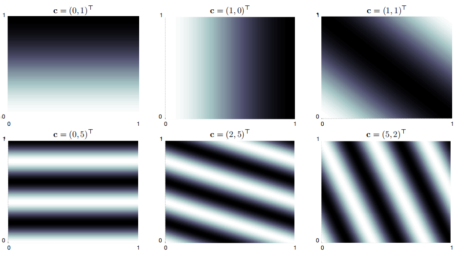

# 基于函数逼近的同轨策略预测

## 价值函数逼近

与之前章节不同地是，近似价值函数不再表示成一个表格，而一个参数化的函数。我们用$$s \mapsto u$$表示一次单独的更新，$$s$$表示要更新的状态，$$u$$表示$$s$$的估计价值的更新目标，比如

- MC的更新是$$S_t \mapsto G_t$$
- TD(0)的更新是$$S_{t} \mapsto R_{t+1}+\gamma \hat{v}\left(S_{t+1}, \mathbf{w}_{t}\right)$$
- n步TD的更新是$$S_t \mapsto G_{t:t+n}$$
- DP的更新是$$s \mapsto \mathbb{E}_{\pi}\left[R_{t+1}+\gamma \hat{v}\left(S_{t+1}, \mathbf{w}_{t}\right) | S_{t}=s\right]$$

我们可以将一次更新解释为给价值函数指定一个理想的“输入-输出”，学习拟合“输入-输出”的方法叫做**有监督学习**，当输出$$u$$为数字诗，这个过程称为**函数逼近**。

原则上我们可以使用任何有监督学习的方法，包括ANN、决策树以及各种多元回归。但是并非所有函数逼近方法都有效。ANN需要一个静态训练集进行训练，而RL问题中，需要能够在线学习，即与环境或环境模型进行交互。

此外，RL通常要能处理**非平稳目标函数**，即随时间变化的目标函数。

## 预测目标（$$\overline{\mathbf{V} \mathbf{E}}$$）

在表格情况下，不需要衡量预测质量，因为学习到的价值函数完全可以和真实的价值函数相等。

另外，在表格情况下每个状态的价值函数都是解耦合的，但是在函数逼近方法中，更新一个状态的价值，必然会影响其他状态的价值，那么一个状态的估计价值越准确，那别的状态的估计价值势必不那么准确。

针对这个问题，我们需要指定一个概率分布$$\mu(s) \geq 0, \sum_{s} \mu(s)=1$$，来表示我们对每个状态的误差的重视程度，将这个分布作为误差的全职，得到一个目标函数，成为均方价值误差（*Mean Squared* *Value Error*）
$$
\overline{\mathrm{VE}}(\mathbf{w}) \doteq \sum_{s \in \mathcal{S}} \mu(s)\left[v_{\pi}(s)-\hat{v}(s, \mathbf{w})\right]^{2}
$$
通常我们把$$\mu(s)$$定义为在$$s$$上消耗的计算的比例。

在分幕式任务中，令$$h(s)$$表示从状态$$s$$开始一幕交互序列的概率，$$\bar s$$表示$$s$$可能的前导状态，$$\eta(s)$$表示$$s$$在单幕交互中的消耗的平均时间（时刻步数），计算方法为
$$
\eta(s)=h(s)+\sum_{\bar{s}} \eta(\bar{s}) \sum_{a} \pi(a | \bar{s}) p(s | \bar{s}, a), \quad \text { for all } s \in \mathcal{S}
$$
可以求解这个方程组得到期望的访问次数$$\eta(s)$$，同轨策略分布被定义为其归一化的时间消耗比例
$$
\mu(s)=\frac{\eta(s)}{\sum_{s^{\prime}} \eta\left(s^{\prime}\right)}, \text { for all } s \in \mathcal{S}
$$
对于$$\overline{\mathbf{V} \mathbf{E}}$$而言，我们要尽可能找到一个全局最优的权值向量$$\mathbf{w}^*$$，满足$$\overline{\mathrm{VE}}\left(\mathbf{w}^{*}\right) \leq \overline{\mathrm{VE}}(\mathbf{w})$$，这对于一些间的函数模型（如线性模型）可能会找到最优解，但对于复杂模型（如ANN或决策树）就比较困难，可能找到局部最优。

我们结合前两小节，总结一下能用于价值函数预测的方法框架：

1. 使用前者的更新来生成后者的训练数据
2. 试图最小化性能度量$$\overline{\mathbf{V} \mathbf{E}}$$
3. 使用一种方法进行函数逼近

函数逼近的方法有很多，本章后面将重点讨论基于梯度的函数逼近方法，特别是线性梯度下降法。

## 随机梯度和半梯度方法

我们假设样本中的状态分布，和$$\overline{\mathbf{V} \mathbf{E}}$$中的分布相同。我们可以使用随机梯度下降（SGD）的方法对于每一个样本，减少其误差
$$
\begin{aligned}
\mathbf{w}_{t+1} & \doteq \mathbf{w}_{t}-\frac{1}{2} \alpha \nabla\left[v_{\pi}\left(S_{t}\right)-\hat{v}\left(S_{t}, \mathbf{w}_{t}\right)\right]^{2} \\
&=\mathbf{w}_{t}+\alpha\left[v_{\pi}\left(S_{t}\right)-\hat{v}\left(S_{t}, \mathbf{w}_{t}\right)\right] \nabla \hat{v}\left(S_{t}, \mathbf{w}_{t}\right)
\end{aligned}
$$
对于一个向量$$w$$的标量函数$$f(w)$$，其梯度$$\nabla f(\mathbf{w})$$是一个列向量
$$
\nabla f(\mathbf{w}) \doteq\left(\frac{\partial f(\mathbf{w})}{\partial w_{1}}, \frac{\partial f(\mathbf{w})}{\partial w_{2}}, \ldots, \frac{\partial f(\mathbf{w})}{\partial w_{d}}\right)^{\top}
$$
随机梯度下降的“随机”体现在更新仅依赖于一个随机选择样本来完成

如果$$\alpha$$满足标准近似条件（$$\sum_{n=1}^{\infty} \alpha_{n}(a)=\infty \quad \text { and } \quad \sum_{n=1}^{\infty} \alpha_{n}^{2}(a)<\infty$$）的方式减小，那么SGD就能保证收敛到局部最优解

现在我们讨论这样一种情况：第$$t$$个训练样本$$S_t \mapsto U_t$$的目标输出$$U_t$$不是真实的价值$$v_\pi(S_t)$$，而是一个随机近似，我们将讨论两种方法近似$$v_\pi(S_t)$$。

第一是方法是使用蒙特卡罗目标$$U_t\doteq G_t$$，由于$$G_t$$是一个无偏估计，因此能够保证SGD收敛到一个局部最优解

下面展示了完整的伪代码

第二方式是使用自举目标，如n步回报$$G_{t:t+n}$$

或DP目标$$\sum_{a, s^{\prime}, r} \pi\left(a | S_{t}\right) p\left(s^{\prime}, r | S_{t}, a\right)\left[r+\gamma \hat{v}\left(s^{\prime}, \mathbf{w}_{t}\right)\right]$$，这些目标都是和权值向量$$\mathbf{w}_{t}$$有关，这意味着他们是有偏的，所以无法实现SGD。

但是我们可以在求梯度时不考虑目标中的权值向量$$\mathbf{w}_{t}$$，由于只包含一部分梯度，我们称之为**半梯度方法**。

这种方法虽然不像梯度方法那样稳健地收敛，但是在一些重要的情况下（如线性情况）可以可靠地收敛。它的优点是学习速度较快，可以持续地、在线地学习，而不需要等待一幕结束。

半梯度TD(0)是一个半梯度方法，它使用$$U_{t} \doteq R_{t+1}+\gamma \hat{v}\left(S_{t+1}, \mathbf{w}\right)$$作为目标，下面给出它的伪代码

## 线性方法

我们用特征向量$$\mathbf{x}(s)$$表示状态，线性近似的状态价值函数可以写作$$\mathbf{w}$$和$$\mathbf{x}(s)$$的内积（关于特征构造的方法将在下一节讨论）
$$
\hat{v}(s, \mathbf{w}) \doteq \mathbf{w}^{\top} \mathbf{x}(s) \doteq \sum_{i=1}^{d} w_{i} x_{i}(s)
$$
对于线性函数逼近，可以使用SGD更新，近似价值函数关于$$\mathbf{w}$$的梯度是
$$
\nabla \hat{v}(s, \mathbf{w})=\mathbf{x}(s)
$$
更新式在线性情况下可以化为一个简单的形式
$$
\mathbf{w}_{t+1} \doteq \mathbf{w}_{t}+\alpha\left[U_{t}-\hat{v}\left(S_{t}, \mathbf{w}_{t}\right)\right] \mathbf{x}\left(S_{t}\right)
$$
使用半梯度TD(0)算法在每个时刻的更新是
$$
\begin{aligned}
\mathbf{w}_{t+1} & \doteq \mathbf{w}_{t}+\alpha\left(R_{t+1}+\gamma \mathbf{w}_{t}^{\top} \mathbf{x}_{t+1}-\mathbf{w}_{t}^{\top} \mathbf{x}_{t}\right) \mathbf{x}_{t} \\
&=\mathbf{w}_{t}+\alpha\left(R_{t+1} \mathbf{x}_{t}-\mathbf{x}_{t}\left(\mathbf{x}_{t}-\gamma \mathbf{x}_{t+1}\right)^{\top} \mathbf{w}_{t}\right)
\end{aligned}
$$
一旦系统达到一个稳定状态，对于任意给定的$$\mathbf{w}_t$$，下一个更新的权值向量的期望可以写作
$$
\mathbb{E}\left[\mathbf{w}_{t+1} | \mathbf{w}_{t}\right]=\mathbf{w}_{t}+\alpha\left(\mathbf{b}-\mathbf{A} \mathbf{w}_{t}\right)
$$
其中
$$
\mathbf{b} \doteq \mathbb{E}\left[R_{t+1} \mathbf{x}_{t}\right] \in \mathbb{R}^{d} \quad \text { and } \quad \mathbf{A} \doteq \mathbb{E}\left[\mathbf{x}_{t}\left(\mathbf{x}_{t}-\gamma \mathbf{x}_{t+1}\right)^{\top}\right] \in \mathbb{R}^{d} \times \mathbb{R}^{d}
$$

如果系统收敛，那么它必须收敛于满足下式的权值向量$$\mathbf{w}_{\text TD}$$，这个量称为TD不动点
$$
\begin{aligned}
\mathbf{b}-\mathbf{A} \mathbf{w}_{\mathrm{TD}} &=\mathbf{0} \\
\mathbf{b} &=\mathbf{A} \mathbf{w}_{\mathrm{TD}} \\
\mathbf{w}_{\mathrm{TD}} & \doteq \mathbf{A}^{-1} \mathbf{b}
\end{aligned}
$$
可以证明矩阵$$\mathbf{A}$$是正定的（详见原文*Proof of Convergence of Linear TD(0)*）

在TD不动点处，已经证明（在持续性任务的情况下）$$\overline{\mathbf{V} \mathbf{E}}$$在可能的最小误差的一个扩展边界内
$$
\overline{\mathrm{VE}}\left(\mathbf{w}_{\mathrm{TD}}\right) \leq \frac{1}{1-\gamma} \min _{\mathbf{w}} \overline{\mathrm{VE}}(\mathbf{w})
$$
上式也适用于其他同轨策略的自举方法，如半梯度DP
$$
U_{t} \doteq \sum_{a} \pi\left(a | S_{t}\right) \sum_{s^{\prime}, r} p\left(s^{\prime}, r | S_{t}, a\right)[r+\gamma \hat{v}\left(s^{\prime}, \mathbf{w}_{t}\right)]
$$
但是由于$$\gamma$$是一个接近1的数，所以这个扩展因子可能相当大，但与MC方法相比，TD方法的方差大大减小，因此速度更快。

n步半梯度TD算法的伪代码如下

这个算法的关键方程是
$$
\mathbf{w}_{t+n} \doteq \mathbf{w}_{t+n-1}+\alpha\left[G_{t: t+n}-\hat{v}\left(S_{t}, \mathbf{w}_{t+n-1}\right)\right] \nabla \hat{v}\left(S_{t}, \mathbf{w}_{t+n-1}\right), \quad 0 \leq t<T=
$$
这里的n步回报为
$$
G_{t: t+n} \doteq R_{t+1}+\gamma R_{t+2}+\cdots+\gamma^{n-1} R_{t+n}+\gamma^{n} \hat{v}\left(S_{t+n}, \mathbf{w}_{t+n-1}\right), \quad 0 \leq t \leq T-n
$$

## 线性方法的特征构造

线性方法不仅能够保证收敛性，而且在数据和计算上可以非常高级。但是，线性形式的一个局限性在于它无法表示特征之间的相互作用。

### 多项式基

假设每一个状态$$s$$对应$$k$$个数字分量$$s_{1}, s_{2}, \dots, s_{k}$$，每一个$$s_{i} \in \mathbb{R}$$，对于这个$$k$$维状态空间，每一个$$n$$阶多项式基特征$$x_i$$可以写作
$$
x_{i}(s)=\Pi_{j=1}^{k} s_{j}^{c_{i, j}}
$$
这里$$c_{i,j}$$是集合$$\{0,1, \ldots, n\}$$中的一个整数。用于$$k$$维状态的$$n$$阶多项式基特征，含有$$(n+1)^k$$个不同的特征

例：单个状态$$s$$对应两个数字分别是$$s_1$$和$$s_2$$，我们用2阶多项式基特征表示这个状态，可以得到
$$
\mathbf{x}(s)=\left(1, s_{1}, s_{2}, s_{1} s_{2}, s_{1}^{2}, s_{2}^{2}, s_{1} s_{2}^{2}, s_{1}^{2} s_{2}, s_{1}^{2} s_{2}^{2}\right)
$$
$$n=2$$，有
$$
C=\left(\begin{array}{ll}
0 & 0 \\
1 & 0 \\
0 & 1 \\
1 & 1 \\
2 & 0 \\
0 & 2 \\
1 & 2 \\
2 & 1 \\
2 & 2
\end{array}\right)
$$

### 傅立叶基

假设每一个状态$$s$$对应一个$$k$$维向量$$\mathbf{s}=(s_{1}, s_{2}, \dots, s_{k})^{\top}$$，每一个$$s_{i} \in [0,1]$$，对于这个$$k$$维状态空间，$$n$$阶傅立叶余弦基的第$$i$$个特征可以写作
$$
x_{i}(s)=\cos \left(\pi \mathbf{s}^{\top} \mathbf{c}^{i}\right)
$$
这里$$\mathbf{c}^{i}=\left(c_{1}^{i}, \ldots, c_{k}^{i}\right)^{\top}, \text { with } c_{j}^{i} \in\{0, \ldots, n\} \text { for } j=1, \ldots, k \text { and } i=1, \ldots,(n+1)^{k}$$

内积$$\mathbf{s}^{\top} \mathbf{c}^{i}$$的作用就是把$$\{0, \ldots, n\}$$中的一个整数赋给$$\mathbf{s}$$中的每一维，$$c_{j}^{i}$$表示在第$$j$$维上的频率

例：$$\mathbf{s}=(s_{1}, s_{2})^{\top}$$，$$n=2$$，使用2阶傅立叶余弦基表示，$$\mathbf{c}^{i}$$是矩阵$$C$$的第$$i$$行（$$C$$的定义和上个例子相同）

则
$$
\mathbf{x}(s)=\left(\begin{array}{ll}
\cos \left(0\right) \\
\cos \left(\pi s_1)\right) \\
\cos \left(\pi s_2\right) \\
\cos \left(\pi (s_1+s_2)\right) \\
\cos \left(\pi 2s_1\right) \\
\cos \left(\pi 2s_2\right) \\
\cos \left(\pi (s_1+2s_2)\right) \\
\cos \left(\pi (2s_1+s_2)\right) \\
\cos \left(\pi (2s_1+2s_2)\right) 
\end{array}\right)
$$
在学习过程中，建议对于每一个特征$$x_{i}$$最好使用不同的步长参数
$$
\alpha_i=\alpha / \sqrt{\left(c_{1}^{i}\right)^{2}+\cdots+\left(c_{k}^{i}\right)^{2}}
$$
除非每个$$c_{1}^{i}=0$$，这是令$$\alpha_i=0$$

向量$$\mathbf{c}^{i}$$的作用是可以用来描述变量之间的相互作用，也可以用来消除那些被认为是噪声的高频部分。

然而傅立叶特征在不连续性方面存在问题，除非包含非常高频的基函数，否则很难避免不连续点周围的波动问题。

下图展示了傅立叶基和多项式基在1000状态随机游走问题上的结果

一般来说，不建议使用多项式基进行在线学习

### 其他编码

- 粗编码
- 瓦片编码
- 径向基函数

## 手动选择步长参数

大部分SGD方法都需要选取适当的步长参数$$\alpha$$。在表格型MC方法中，选择$$\alpha_t=1/t$$，但不适用于TD方法，不适用于非稳定问题，也不适用于任何函数逼近。一般情况下，如果$$\alpha_t=1/\tau$$，那么一个状态的表格型估计将在大约$$\tau$$次经验后接近他的目标均值，且更近的目标影响更大。

假设从基本上相同的特征向量的$$\tau$$次经验来学习，一个好的粗略经验法则是将步长参数设置为
$$
\alpha \doteq\left(\tau \mathbb{E}\left[\mathbf{x}^{\top} \mathbf{x}\right]\right)^{-1}
$$
这里$$\mathbf{x}$$是从SGD的输入向量的分布中选取的一个随机特征向量。这种方法在特征向量的长度变化不大时特别有效。在理想情况下，$$\mathbf{x}^{\top} \mathbf{x}$$为常数。

## 非线性函数逼近：人工神经网络

略

## 最小二乘时序差分

前面我们讨论了使用线性函数逼近TD(0)可以渐进地收敛（要求步长适当减小）到TD不动点
$$
\mathbf{w}_{\mathrm{TD}}=\mathbf{A}^{-1} \mathbf{b}
$$
其中
$$
\mathbf{A} \doteq \mathbb{E}\left[\mathbf{x}_{t}\left(\mathbf{x}_{t}-\gamma \mathbf{x}_{t+1}\right)^{\top}\right] \quad \text { and } \quad \mathbf{b} \doteq \mathbb{E}\left[R_{t+1} \mathbf{x}_{t}\right]
$$
我们可以直接对$$\mathbf{A}$$和$$\mathbf{b}$$进行估计，这称为**最小二乘时序差分**（LSTD）
$$
\widehat{\mathbf{A}}_{t} \doteq \sum_{k=0}^{t-1} \mathbf{x}_{k}\left(\mathbf{x}_{k}-\gamma \mathbf{x}_{k+1}\right)^{\top}+\varepsilon \mathbf{I} \quad \text { and } \quad \widehat{\mathbf{b}}_{t} \doteq \sum_{k=0}^{t-1} R_{k+1} \mathbf{x}_{k}
$$
$$\varepsilon \mathbf{I}$$这一项可以保证$$\widehat{\mathbf{A}}_{t}$$总是可逆，这个需要人为设置，如果设的过小，则这些逆的变化可能变化非常大，如果设的过大，则学习过程会变得很慢。

估计的TD不动点为
$$
\mathbf{w}_{t} \doteq \widehat{\mathbf{A}}_{t}^{-1} \widehat{\mathbf{b}}_{t}
$$
复杂度的讨论：

$$\widehat{\mathbf{A}}_{t}$$和$$\widehat{\mathbf{b}}_{t}$$可以用增量式实现，其计算复杂度可以控制在常数级。$$\widehat{\mathbf{A}}_{t}$$的更新涉及一个外积计算，计算复杂度是$$O(d^2)$$，空间复杂度也是$$O(d^2)$$。

更大的问题是计算$$\widehat{\mathbf{A}}_{t}$$的逆复杂度是$$O(d^3)$$，我们可以采用复杂度为$$O(d^2)$$的增量式更新
$$
\begin{aligned}
\widehat{\mathbf{A}}_{t}^{-1} &=\left(\widehat{\mathbf{A}}_{t-1}+\mathbf{x}_{t-1}\left(\mathbf{x}_{t-1}-\gamma \mathbf{x}_{t}\right)^{\top}\right)^{-1} \\
&=\widehat{\mathbf{A}}_{t-1}^{-1}-\frac{\widehat{\mathbf{A}}_{t-1}^{-1} \mathbf{x}_{t-1}\left(\mathbf{x}_{t-1}-\gamma \mathbf{x}_{t}\right)^{\top} \widehat{\mathbf{A}}_{t-1}^{-1}}{1+\left(\mathbf{x}_{t-1}-\gamma \mathbf{x}_{t}\right)^{\top} \widehat{\mathbf{A}}_{t-1}^{-1} \mathbf{x}_{t-1}}
\end{aligned}
$$

上式称为*Sherman-Morrison*公式，复杂度为$$O(d^2)$$。

当然，$$O(d^2)$$显著高于半梯度TD的$$O(d)$$复杂度，但是不需要设置步长参数。另外LSTD没有步长意味着它没有遗忘机制，当目标策略想GPI中那样不断变化是，就会产生问题。

$$O(d^2)$$版本的LSTD，用于估计$$\hat{v}=\mathbf{w}^{\top} \mathbf{x}(\cdot) \approx v_{\pi}$$

## 基于记忆的函数逼近

基于记忆的函数逼近是非参数化的主要例子，它仅在记忆中保存看到过的训练样本（至少是样本的子集），每当查询的时候，就从记忆中检索**一组**样本，然后用这些样本来计算查询状态的估计价值。

常用的方法有：

- 最近邻法
- 加权平均法（检索一组最近的样本，返回加权平均值）
- 局部加权回归法（通过参数化的方法拟合一个曲面，返回曲面上的一个值，最后舍弃这个曲面）
- 使用k-d树

## 基于核函数的函数逼近

例如加权平均法和局部加权回归法，分配权值的函数称为**核函数**，通常记为$$k: S \times S \rightarrow \mathbb{R}$$，即$$k(s,s')$$是在查询状态为$$s$$，为$$s'$$对查询回复的影响分配的权值。

核函数回归是一种基于记忆的方法，如果$$\mathcal{D}$$是一组储存的样本，而$$g\left(s^{\prime}\right)$$表示储存样本中状态$$s^{\prime}$$的目标结果，那么核函数回归会逼近目标函数，在这种情况下，基于$$\mathcal{D}$$的价值函数表示为
$$
\hat{v}(s, \mathcal{D})=\sum_{s^{\prime} \in \mathcal{D}} k\left(s, s^{\prime}\right) g\left(s^{\prime}\right)
$$
一个常用的核函数是在RBF函数逼近中使用的高斯径向基函数
$$
x_{i}(s) \doteq \exp \left(-\frac{\left\|s-c_{i}\right\|^{2}}{2 \sigma_{i}^{2}}\right)
$$
RBF特征的中心要么是一开始就固定，中心重要在许多样本出现的区域；要么是在学习过程中不断调整。

线性方法也可以被重塑为核函数的回归，即
$$
k\left(s, s^{\prime}\right)=\mathbf{x}(s)^{\top} \mathbf{x}\left(s^{\prime}\right)
$$

## 深入了解同轨策略学习：“兴趣”与“强调”

我们定义一个非负随机标量变量$$I_t$$，称之为**兴趣值**，表示在$$t$$时刻有多大兴趣要精确估计一个状态的价值；定义另一个非负随机标量变量$$M_t$$，成为强调值，这个标量会被乘上学习过程中的更新量，决定强调或者不强调学习。

强调值由兴趣值递归地确定
$$
M_{t}=I_{t}+\gamma^{n} M_{t-n}, \quad 0 \leq t<T
$$
当$$t<0$$时，$$M_t\doteq 0$$

结合以上定义，我们给出一个更一般的n步学习法则
$$
\mathbf{w}_{t+n} \doteq \mathbf{w}_{t+n-1}+\alpha M_{t}\left[G_{t: t+n}-\hat{v}\left(S_{t}, \mathbf{w}_{t+n-1}\right)\right] \nabla \hat{v}\left(S_{t}, \mathbf{w}_{t+n-1}\right), \quad 0 \leq t<T^{-}
$$
其中
$$
G_{t: t+n} \doteq R_{t+1}+\gamma R_{t+2}+\cdots+\gamma^{n-1} R_{t+n}+\gamma^{n} \hat{v}\left(S_{t+n}, \mathbf{w}_{t+n-1}\right), \quad 0 \leq t \leq T-n
$$
这个更新法则也包括了MC的情况，只需要$$G_{t: t+n}=G_{t}$$，所有的更新在没幕的结尾进行，$$n=T-t$$以及$$M_t=I_t$$。